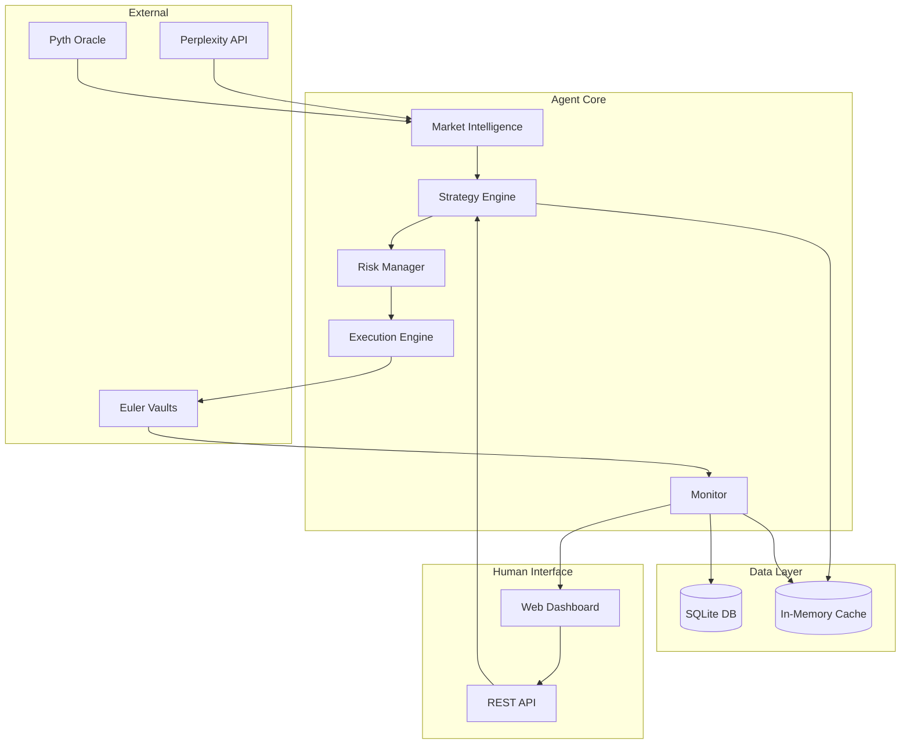

# PRD: xLever AI Agent for Automated Trading & Position Management

| Field | Value |
|-------|-------|
| **PRD ID** | XLEVER-AGENT-001 |
| **Title** | AI Agent for Automated Trading & Position Management |
| **Author** | Eric & Maroua |
| **Created** | 2026-04-01 |
| **Priority** | P0 (Hackathon Deliverable) |
| **Status** | Draft |
| **Target Repo** | `xLever/agent/` |
| **Estimated Effort** | 2-3 weeks |
| **Dependencies** | Deployed Euler vaults, Perplexity API, Pyth Oracle |

---

## 0. Breaking Changes

This is a **greenfield implementation** — no existing agent code to migrate. However, integration requires:

- **New dependency**: `web3.py` for blockchain interaction
- **New dependency**: Perplexity API client for market intelligence
- **New environment variables**: API keys, RPC endpoints, wallet private keys
- **Database requirement**: Position state persistence (SQLite)
- **Frontend integration**: WebSocket for real-time updates + REST API for HITL controls

---

## 1. Purpose & Problem

### Problem Statement

The xLever protocol provides leveraged exposure to tokenized assets (wSPYx, wQQQx) without liquidation risk. However, managing leveraged positions requires:

1. **Continuous monitoring**: 24/7 price tracking, health score monitoring, funding rate awareness
2. **Market intelligence**: Understanding macro events, earnings, sentiment that affect position risk
3. **Execution precision**: Timing entries/exits to minimize fees (dynamic spread pricing)
4. **Risk management**: Automated stop-loss, take-profit, and position sizing based on protocol state

Manual trading is impractical because:
- Markets operate 24/7 (especially crypto/tokenized assets)
- Protocol constraints (1h leverage lock, dynamic caps) require careful planning
- Fee optimization requires monitoring TWAP divergence continuously
- Health score can cascade through 5 ADL levels quickly in volatile markets

### Why Now?

- Euler vaults are deployed and tested on Ink Sepolia
- Protocol constraints and fee structures are finalized
- Hackathon deadline requires demonstration of autonomous trading capability
- Competitive differentiation: Most leveraged protocols lack intelligent automation

### Who Is Affected

| Persona | Pain |
|---------|------|
| Senior Trader | Cannot monitor positions 24/7, misses optimal entry/exit windows, pays excess fees during high divergence |
| Junior LP | Lacks tools to understand pool exposure and risk before depositing |
| Protocol Team | No automated position management for demo/testing |

### Success Metrics

| Metric | Current | Target | Method |
|--------|---------|--------|--------|
| Position monitoring latency | N/A | < 5 seconds | Time from price change to agent awareness |
| Fee optimization | Manual (often 0.12%+) | < 0.10% avg entry fee | Track actual fees vs theoretical minimum |
| Risk response time | Manual | < 30 seconds for HS < 1.3 | Time from health score drop to action |
| Autonomous operation uptime | 0% | > 99% | Agent process monitoring |
| Human intervention rate | 100% | < 10% (optional) | Trades executed without manual approval |

---

## 2. Features & Functionality

### 2.1 Market Intelligence Layer (Perplexity Integration)

**Purpose**: Gather real-time market intelligence to inform trading decisions.

**Data Sources**:
- Perplexity API: `https://api.perplexity.ai/chat/completions`
- Pyth Oracle: On-chain price feeds for wSPYx, wQQQx
- Yahoo Finance (existing proxy): Historical price data for backtesting

**Collection/Processing Steps**:
1. Query Perplexity every 15 minutes (or on significant price movement >1%)
2. Extract sentiment (bullish/bearish/neutral) and key events
3. Identify relevant macro factors (Fed meetings, earnings, market hours)
4. Cross-reference with on-chain data (pool imbalance, funding rate)
5. Generate market context summary for strategy engine

**LLM Synthesis Prompt**:
```
You are a market analyst for tokenized US equity assets (SP500, NASDAQ trackers).

Current data:
- wSPYx (SP500 tracker): ${wspyx_price} USD, 24h change: ${wspyx_24h_change}%
- wQQQx (NASDAQ tracker): ${wqqqx_price} USD, 24h change: ${wqqqx_24h_change}%
- Pool state: ${net_exposure_direction} net exposure, funding rate: ${funding_rate}%
- TWAP divergence: ${divergence}%

Analyze:
1. Current market sentiment (bullish/bearish/neutral) with confidence 0-100
2. Key events in next 24-48 hours affecting US equities
3. Risk factors that could cause >3% moves
4. Recommended position bias (long/short/neutral) with reasoning

Respond in JSON format:
{
  "sentiment": "bullish|bearish|neutral",
  "confidence": 0-100,
  "upcoming_events": ["event1", "event2"],
  "risk_factors": ["risk1", "risk2"],
  "position_bias": "long|short|neutral",
  "reasoning": "brief explanation"
}
```

**Output Schema**:
```json
{
  "sentiment": "string — bullish|bearish|neutral",
  "confidence": "number — 0-100",
  "upcoming_events": ["string — event descriptions"],
  "risk_factors": ["string — risk descriptions"],
  "position_bias": "string — long|short|neutral",
  "reasoning": "string — explanation",
  "timestamp": "ISO8601 datetime"
}
```

**Failure Mode**: If Perplexity API fails, agent continues with last known intelligence (max 1 hour stale). If stale > 1 hour, agent enters "conservative mode" (reduce leverage to 1x, no new positions).

**Downstream Consumers**: Strategy Engine, Risk Management System

---

### 2.2 Strategy Engine (LLM + Rules Hybrid)

**Purpose**: Generate trading decisions combining LLM reasoning with rule-based guardrails.

**Architecture**:
```
┌─────────────────────────────────────────────────────────┐
│                    STRATEGY ENGINE                       │
├─────────────────────────────────────────────────────────┤
│                                                          │
│   ┌─────────────────┐     ┌─────────────────┐          │
│   │  LLM Reasoning  │     │  Rule Engine    │          │
│   │  (Perplexity)   │────▶│  (Hard Limits)  │          │
│   └─────────────────┘     └────────┬────────┘          │
│                                     │                    │
│                           ┌────────▼────────┐          │
│                           │  Signal Merger  │          │
│                           └────────┬────────┘          │
│                                     │                    │
│                           ┌────────▼────────┐          │
│                           │ Human Approval  │          │
│                           │ (if enabled)    │          │
│                           └────────┬────────┘          │
│                                     │                    │
│                           ┌────────▼────────┐          │
│                           │ Execution Queue │          │
│                           └─────────────────┘          │
│                                                          │
└─────────────────────────────────────────────────────────┘
```

**Rule Engine (Hard Limits)**:

| Rule | Condition | Action |
|------|-----------|--------|
| R1: Max Leverage | Requested > dynamic cap | Reject, use max allowed |
| R2: Leverage Lock | Last increase < 1 hour | Block leverage increase |
| R3: Flip Lock | Long↔Short < 4 hours | Block direction change |
| R4: Divergence Gate | TWAP divergence > 3% | Block all entries |
| R5: Health Guard | HS < 1.4 | Force reduce leverage |
| R6: Position Size | > 20% of pool | Reject (concentration risk) |
| R7: Daily Loss Limit | Realized loss > 5% of capital | Pause trading 24h |
| R8: Gas Guard | Gas > 100 gwei | Delay non-urgent transactions |

**LLM Decision Prompt**:
```
You are a trading agent for xLever protocol. Make position decisions.

Current state:
- Active position: ${position_exists ? position_details : "None"}
- Available capital: ${available_usdc} USDC
- Market intelligence: ${market_summary}
- Pool state: Junior ratio ${junior_ratio}%, max leverage ${max_leverage}x
- Current fees: Entry ${entry_fee}%, Funding rate ${funding_rate}%

Rule constraints (MUST obey):
- Cannot exceed ${max_leverage}x leverage
- Cannot enter if TWAP divergence > 3% (current: ${divergence}%)
- Must wait ${time_until_unlock} for leverage increase (if applicable)

Decide one action:
1. HOLD - No changes
2. OPEN_LONG - Open long position with leverage
3. OPEN_SHORT - Open short position with leverage
4. ADJUST_LEVERAGE - Change leverage on existing position
5. CLOSE - Exit current position

Respond in JSON:
{
  "action": "HOLD|OPEN_LONG|OPEN_SHORT|ADJUST_LEVERAGE|CLOSE",
  "leverage_bps": 10000-40000 (only if opening/adjusting),
  "size_usdc": amount (only if opening),
  "confidence": 0-100,
  "reasoning": "brief explanation",
  "urgency": "low|medium|high"
}
```

**Output Schema**:
```json
{
  "action": "string — HOLD|OPEN_LONG|OPEN_SHORT|ADJUST_LEVERAGE|CLOSE",
  "leverage_bps": "number — 10000-40000 (1x-4x)",
  "size_usdc": "number — position size in USDC",
  "confidence": "number — 0-100",
  "reasoning": "string — explanation",
  "urgency": "string — low|medium|high",
  "rule_violations": ["string — any rules that blocked original decision"]
}
```

**Failure Mode**: If LLM fails, default to HOLD. If consecutive failures > 3, alert and enter manual mode.

---

### 2.3 Risk Management System

**Purpose**: Protect capital through automated risk controls.

**Components**:

#### 2.3.1 Position Sizing
```python
def calculate_position_size(
    capital: float,
    leverage: int,
    confidence: int,
    volatility_24h: float,
    pool_concentration: float
) -> float:
    """
    Kelly-inspired position sizing with safety adjustments.
    """
    base_size = capital * 0.25  # Max 25% per position

    # Confidence adjustment (0-100 → 0.5-1.0 multiplier)
    confidence_mult = 0.5 + (confidence / 200)

    # Volatility adjustment (high vol → smaller size)
    vol_mult = max(0.3, 1 - volatility_24h / 100)

    # Concentration limit (don't be >20% of pool)
    max_by_pool = pool_total * 0.20

    return min(base_size * confidence_mult * vol_mult, max_by_pool)
```

#### 2.3.2 Stop-Loss & Take-Profit
```python
@dataclass
class RiskLimits:
    stop_loss_pct: float = 0.15      # -15% max loss per position
    take_profit_pct: float = 0.30    # +30% take profit
    trailing_stop_pct: float = 0.10  # 10% trailing from peak
    max_daily_loss_pct: float = 0.05 # 5% daily loss limit
```

#### 2.3.3 Health Score Monitor
| Health Score | Agent Action |
|--------------|--------------|
| HS > 1.5 | Normal operation |
| HS 1.4-1.5 | Increase monitoring frequency to 30s |
| HS 1.3-1.4 | Alert, prepare deleveraging tx |
| HS 1.2-1.3 | Auto-reduce leverage by 25% |
| HS 1.1-1.2 | Emergency reduce to 1.5x max |
| HS < 1.1 | Full exit to spot, alert critical |

---

### 2.4 Execution Engine (Web3 Integration)

**Purpose**: Execute trades on-chain via Euler vault contracts.

**Supported Actions**:

| Action | Contract Call | Gas Estimate |
|--------|---------------|--------------|
| Open Long | `hedgingModule.openLongPosition(collateral, leverage)` | ~300k |
| Open Short | `hedgingModule.openShortPosition(collateral, leverage)` | ~300k |
| Close | `hedgingModule.closePosition()` | ~250k |
| Adjust | (close + reopen in batch via EVC) | ~500k |

**Transaction Management**:
```python
class TransactionManager:
    def __init__(self, web3, private_key, config):
        self.web3 = web3
        self.account = Account.from_key(private_key)
        self.max_gas_gwei = config.max_gas_gwei
        self.retry_attempts = 3
        self.timeout_seconds = 120

    async def execute(self, contract_call, urgency: str) -> TxReceipt:
        """Execute with gas optimization and retry logic."""
        gas_price = await self.get_optimal_gas(urgency)

        if gas_price > self.max_gas_gwei and urgency != "high":
            raise GasTooHighError(f"Gas {gas_price} exceeds limit")

        for attempt in range(self.retry_attempts):
            try:
                tx = await self.build_and_sign(contract_call, gas_price)
                receipt = await self.send_and_wait(tx)
                return receipt
            except TransactionFailed as e:
                if attempt == self.retry_attempts - 1:
                    raise
                await asyncio.sleep(2 ** attempt)  # Exponential backoff
```

**Contract Addresses** (Ink Sepolia):
```python
CONTRACTS = {
    # Core Protocol
    "EVC": "0x9B8d1851bCc06ac265c1c1ACaBD0F71E69DD312c",

    # Hedging Modules (main entry points for trades)
    "wSPYx_HEDGING": "0xd0673BeB607CA2136b126d34ED0D3Ff7826c93EE",
    "wQQQx_HEDGING": "0x3Bc3c0D268455aD7eAe1432f57f3C24f42EdC7C8",

    # Tokens
    "USDC": "0x6b57475467cd854d36Be7FB614caDa5207838943",
    "wSPYx": "0x9eF9f9B22d3CA9769e28e769e2AAA3C2B0072D0e",
    "wQQQx": "0x267ED9BC43B16D832cB9Aaf0e3445f0cC9f536d9",

    # Euler Vaults (for health score, pool state)
    "USDC_VAULT": "0x92E92FDcAc9dfED71721468Efcb6952Ec898aC53",
    "wSPYx_VAULT": "0x6d064558d58645439A64cE1e88989Dfba88AA052",
    "wQQQx_VAULT": "0x3AeFf4ad3ee66885de6cE1a485425bd8C987FCe9",

    # Interest Rate Model
    "IRM": "0xE91A4B01632a7D281fb3eB0E83Ad9D5F0305d48f",
}

# Oracle Configuration
# NOTE: Testnet uses FixedPriceOracle. Production will use Pyth → TWAPOracle.
# For the agent, we use Pyth Hermes API directly for real-time prices.
PYTH_CONFIG = {
    "HERMES_URL": "https://hermes.pyth.network",
    "PRICE_FEEDS": {
        "SPY/USD": "0x19e09bb805456ada3979a7d1cbb4b6d63babc3a0f8e8a9509f68aca0c4ae8a14",
        "QQQ/USD": "0x9695e2b96ea7b3859da9ed25b7a46a920a776e2fdae19a7bcfdf2b219230452d",
        "ETH/USD": "0xff61491a931112ddf1bd8147cd1b641375f79f5825126d665480874634fd0ace",
    },
}
```

---

### 2.5 Human-in-the-Loop Interface

**Purpose**: Allow optional human oversight and approval for trading decisions.

**Modes**:

| Mode | Behavior |
|------|----------|
| `AUTONOMOUS` | Agent executes all decisions without approval |
| `APPROVAL_REQUIRED` | All trades require human approval via API/UI |
| `APPROVAL_ABOVE_THRESHOLD` | Require approval for positions > $X or leverage > Y |
| `NOTIFICATIONS_ONLY` | Agent executes, sends notifications for awareness |

**Approval Flow**:
```
Agent Decision
      │
      ▼
┌─────────────────┐
│ Check HITL Mode │
└────────┬────────┘
         │
    ┌────┴────┐
    │         │
    ▼         ▼
AUTONOMOUS  APPROVAL_*
    │         │
    │    ┌────▼────┐
    │    │ Queue   │
    │    │ Decision│
    │    └────┬────┘
    │         │
    │    ┌────▼────────────┐
    │    │ Wait for Human  │
    │    │ (timeout: 5min) │
    │    └────┬────────────┘
    │         │
    │    ┌────┴────┐
    │    │         │
    │    ▼         ▼
    │  APPROVED  TIMEOUT/REJECTED
    │    │         │
    │    │    ┌────▼────┐
    │    │    │ Check   │
    │    │    │ Urgency │
    │    │    └────┬────┘
    │    │         │
    │    │    ┌────┴────┐
    │    │    ▼         ▼
    │    │  HIGH      LOW
    │    │    │         │
    │    │    │    ┌────▼────┐
    │    │    │    │ Cancel  │
    │    │    │    └─────────┘
    │    │    │
    └────┴────┴──────▼
              ┌─────────┐
              │ EXECUTE │
              └─────────┘
```

**API Endpoints**:
```
POST /api/agent/mode          - Set HITL mode
GET  /api/agent/pending       - List pending decisions
POST /api/agent/approve/{id}  - Approve pending decision
POST /api/agent/reject/{id}   - Reject pending decision
POST /api/agent/override      - Manual trade override
GET  /api/agent/status        - Agent health and state
```

---

### 2.6 Monitoring & Alerting

**Purpose**: Real-time visibility into agent operations and portfolio state.

**Metrics to Track**:

| Category | Metric | Collection Frequency |
|----------|--------|---------------------|
| Portfolio | Total value (USDC) | Every block |
| Portfolio | Unrealized PnL | Every block |
| Portfolio | Current leverage | Every block |
| Protocol | Health score | Every 10 seconds |
| Protocol | TWAP divergence | Every 12 seconds |
| Protocol | Funding rate | Every 8 hours |
| Agent | Decisions made | On event |
| Agent | Trades executed | On event |
| Agent | Errors/failures | On event |

**Alert Thresholds**:

| Alert | Condition | Channel | Severity |
|-------|-----------|---------|----------|
| Health Warning | HS < 1.4 | WebSocket, Log | Warning |
| Health Critical | HS < 1.2 | WebSocket, Log | Critical |
| Large Loss | Position PnL < -10% | WebSocket | Warning |
| Stop Loss Hit | Position closed by SL | WebSocket | Info |
| Agent Error | 3+ consecutive failures | WebSocket, Log | Error |
| Gas Spike | Gas > 200 gwei | WebSocket | Info |

**Future Enhancement**: Email notifications (deferred for post-hackathon)

---

### 2.7 Backtesting & Paper Trading

**Purpose**: Validate strategies before live deployment.

**Paper Trading Mode**:
- Connect to real price feeds (Pyth oracle)
- Simulate contract calls (no actual transactions)
- Track virtual portfolio state
- Same decision logic as live mode

**Backtesting Framework**:
```python
class Backtester:
    def __init__(self, strategy: Strategy, data: pd.DataFrame):
        self.strategy = strategy
        self.data = data  # OHLCV with timestamps
        self.portfolio = SimulatedPortfolio()

    def run(self, start_date: datetime, end_date: datetime) -> BacktestResult:
        for timestamp, candle in self.data.iterrows():
            # Simulate market state
            market_state = self.build_state(candle)

            # Get strategy decision
            decision = self.strategy.decide(market_state)

            # Execute (simulated)
            self.portfolio.execute(decision, candle.close)

            # Track metrics
            self.record_metrics(timestamp)

        return BacktestResult(
            total_return=self.portfolio.total_return(),
            sharpe_ratio=self.portfolio.sharpe_ratio(),
            max_drawdown=self.portfolio.max_drawdown(),
            win_rate=self.portfolio.win_rate(),
            trades=self.portfolio.trade_history
        )
```

---

### User Workflows

**Workflow: Autonomous Trading Setup**
1. User configures agent with API keys and wallet
2. User sets risk parameters (max leverage, position size, stop-loss)
3. User selects trading mode (AUTONOMOUS or APPROVAL_REQUIRED)
4. Agent starts monitoring and trading
5a. Success: Agent manages positions, sends notifications
5b. Alert: Human receives notification, can intervene

**Workflow: Human Approval Flow**
1. Agent identifies trading opportunity
2. Agent queues decision for approval
3. User receives notification (WebSocket to Dashboard)
4. User reviews decision details (reasoning, confidence, size)
5a. Approve: Agent executes trade
5b. Reject: Agent cancels and logs
5c. Timeout: Agent acts based on urgency setting

**Workflow: Emergency Override**
1. User observes concerning position
2. User sends emergency close command
3. Agent immediately closes all positions
4. Agent enters MANUAL mode until reset
5. User reviews and resumes agent

---

### Edge Cases

| # | Edge Case | Expected Behavior |
|---|-----------|-------------------|
| 1 | Price gaps (market opens) | Wait for TWAP stabilization before trading |
| 2 | Oracle stale (>5 min) | Pause trading, alert, use last known price for monitoring |
| 3 | Contract paused by protocol | Graceful degradation, alert, track pending state |
| 4 | Gas spike during urgent close | Accept higher gas for health-critical trades |
| 5 | Perplexity API rate limit | Use cached intelligence, reduce query frequency |
| 6 | Wallet nonce mismatch | Auto-recover, wait for pending tx confirmation |
| 7 | Partial fill (shouldn't happen on Euler) | Alert and investigate |
| 8 | Chain reorg | Recheck transaction confirmations |

### Out of Scope

- **NOT: Multi-chain support** — Ink Sepolia only for hackathon
- **NOT: Advanced ML models** — LLM-only, no custom model training
- **NOT: Social trading/copy trading** — Single agent instance
- **NOT: Mobile app** — Web dashboard only
- **NOT: Fiat on/off ramp** — Assumes user has USDC

---

## 3. Architecture

### System Overview



### Component Breakdown

| Component | Location | Responsibility | New/Modified |
|-----------|----------|----------------|--------------|
| `MarketIntelligence` | `agent/intelligence/` | Perplexity integration, sentiment analysis | New |
| `StrategyEngine` | `agent/strategy/` | Decision making, LLM prompts, rule engine | New |
| `RiskManager` | `agent/risk/` | Position sizing, stop-loss, health monitoring | New |
| `ExecutionEngine` | `agent/execution/` | Web3 contract calls, tx management | New |
| `Monitor` | `agent/monitor/` | Metrics, alerts, logging | New |
| `HITL Controller` | `agent/hitl/` | Human approval workflows | New |
| `API Server` | `agent/api/` | REST endpoints for dashboard | New |
| `Backtester` | `agent/backtest/` | Historical simulation | New |

### Technical Decisions

| Decision | Options Considered | Choice | Reasoning |
|----------|-------------------|--------|-----------|
| Language | Python, TypeScript, Rust | **Python** | Best Web3 libs, LLM integrations, team familiarity |
| Web3 Library | web3.py, ape, brownie | **web3.py** | Most mature, direct EVM interaction |
| LLM Client | OpenAI SDK, LangChain, direct HTTP | **Direct HTTP** | Simpler, Perplexity-specific, no abstraction overhead |
| Database | SQLite, PostgreSQL, MongoDB | **SQLite** (dev), **PostgreSQL** (prod) | Simple start, scale later |
| Cache | Redis, in-memory, SQLite | **In-memory** | Simplest for hackathon, no external deps |
| API Framework | FastAPI, Flask, Django | **FastAPI** | Async support, auto-docs, modern |

### Database Schema

```sql
-- Position tracking
CREATE TABLE positions (
    id UUID PRIMARY KEY DEFAULT gen_random_uuid(),
    asset VARCHAR(10) NOT NULL,  -- 'wSPYx' or 'wQQQx'
    direction VARCHAR(5) NOT NULL,  -- 'long' or 'short'
    entry_price DECIMAL(20, 8) NOT NULL,
    entry_timestamp TIMESTAMP NOT NULL,
    leverage_bps INTEGER NOT NULL,
    size_usdc DECIMAL(20, 6) NOT NULL,
    current_pnl DECIMAL(20, 6),
    status VARCHAR(20) NOT NULL DEFAULT 'open',  -- 'open', 'closed', 'liquidated'
    close_price DECIMAL(20, 8),
    close_timestamp TIMESTAMP,
    close_reason VARCHAR(50),  -- 'manual', 'stop_loss', 'take_profit', 'health_emergency'
    tx_hash_open VARCHAR(66),
    tx_hash_close VARCHAR(66),
    created_at TIMESTAMP DEFAULT CURRENT_TIMESTAMP
);

-- Decision log
CREATE TABLE decisions (
    id UUID PRIMARY KEY DEFAULT gen_random_uuid(),
    timestamp TIMESTAMP NOT NULL,
    action VARCHAR(20) NOT NULL,
    confidence INTEGER NOT NULL,
    reasoning TEXT,
    market_context JSONB,
    rule_checks JSONB,
    approved BOOLEAN,
    approved_by VARCHAR(50),  -- 'agent', 'human', 'timeout'
    executed BOOLEAN DEFAULT FALSE,
    execution_error TEXT,
    created_at TIMESTAMP DEFAULT CURRENT_TIMESTAMP
);

-- Market intelligence cache
CREATE TABLE market_intelligence (
    id UUID PRIMARY KEY DEFAULT gen_random_uuid(),
    timestamp TIMESTAMP NOT NULL,
    sentiment VARCHAR(10),
    confidence INTEGER,
    upcoming_events JSONB,
    risk_factors JSONB,
    position_bias VARCHAR(10),
    reasoning TEXT,
    source VARCHAR(20) DEFAULT 'perplexity',
    created_at TIMESTAMP DEFAULT CURRENT_TIMESTAMP
);

-- Metrics timeseries
CREATE TABLE metrics (
    timestamp TIMESTAMP NOT NULL,
    metric_name VARCHAR(50) NOT NULL,
    metric_value DECIMAL(30, 10) NOT NULL,
    labels JSONB,
    PRIMARY KEY (timestamp, metric_name)
);
CREATE INDEX idx_metrics_name_time ON metrics(metric_name, timestamp DESC);
```

---

## 4. Dependencies

### Internal Dependencies

| Dependency | Location | Status | Blocking? |
|------------|----------|--------|-----------|
| Deployed Euler vaults | Ink Sepolia | Deployed | No |
| Hedging modules | Ink Sepolia | Deployed | No |
| Contract ABIs | `contracts/out/` | Needs compilation | No |
| Frontend integration | `frontend/app.js` | Needs WebSocket client | No |
| TWAPOracle contract | `contracts/src/xLever/modules/` | Code exists, not deployed | No |
| FixedPriceOracle | `contracts/src/oracles/` | For testnet only | No |

### Integration Points with Main Branch

| Component | Main Branch Location | Agent Integration |
|-----------|---------------------|-------------------|
| **EulerHedgingModule** | `contracts/src/xLever/modules/EulerHedgingModule.sol` | Call `openLongPosition()`, `openShortPosition()`, `closePosition()` |
| **TWAPOracle** | `contracts/src/xLever/modules/TWAPOracle.sol` | Read `getDivergence()`, `isStale()` for fee optimization |
| **IVault Interface** | `contracts/src/xLever/interfaces/IVault.sol` | Read pool state, health scores |
| **Frontend** | `frontend/app.js` | Add WebSocket connection for agent status |
| **Yahoo Finance Proxy** | `server/server.py` | Agent uses Pyth Hermes directly (no dependency) |

### Contract Function Signatures (from main branch)

```solidity
// EulerHedgingModule.sol - Main entry points for agent
function openLongPosition(uint256 initialCollateral, uint256 targetLeverage) external;
function openShortPosition(uint256 initialCollateral, uint256 targetLeverage) external;
// Note: closePosition() needs verification - may be unwindPosition()

// TWAPOracle.sol - For divergence checks
function getDivergence() external view returns (uint256 divergenceBps);
function getDynamicSpread() external view returns (uint16 spreadBps);
function isStale() external view returns (bool);

// IEulerHedging.sol - Health monitoring
function getHealthScore() external view returns (uint256 score);
function getEulerPosition() external view returns (DataTypes.EulerPosition memory);
```

### External Dependencies

| Package/Service | Version | Purpose | Risk |
|-----------------|---------|---------|------|
| `web3.py` | ^6.0 | Ethereum interaction | Low |
| `httpx` | ^0.27 | Async HTTP (Perplexity) | Low |
| `fastapi` | ^0.110 | API server | Low |
| `sqlalchemy` | ^2.0 | Database ORM | Low |
| `cachetools` | ^5.0 | In-memory caching (TTL) | Low |
| `websockets` | ^12.0 | WebSocket for real-time updates | Low |
| Perplexity API | N/A | Market intelligence | Medium (rate limits) |
| Pyth Oracle | N/A | Price feeds | Low (on-chain) |

### Environment Variables

```bash
# Blockchain
RPC_URL=https://rpc-gel-sepolia.inkonchain.com
CHAIN_ID=763373
PRIVATE_KEY=0x...  # Agent wallet (funded with testnet ETH)

# APIs
PERPLEXITY_API_KEY=pplx-...
# WebSocket notifications are sent to connected dashboard clients

# Database
DATABASE_URL=sqlite:///xlever_agent.db

# Agent Config
AGENT_MODE=AUTONOMOUS  # or APPROVAL_REQUIRED
MAX_LEVERAGE_BPS=30000  # 3x default
MAX_POSITION_USDC=10000
STOP_LOSS_PCT=0.15
TAKE_PROFIT_PCT=0.30
```

---

## 5. API Contracts

### Agent Control API

```python
from pydantic import BaseModel
from enum import Enum
from typing import Optional, List
from datetime import datetime

class AgentMode(str, Enum):
    AUTONOMOUS = "AUTONOMOUS"
    APPROVAL_REQUIRED = "APPROVAL_REQUIRED"
    APPROVAL_ABOVE_THRESHOLD = "APPROVAL_ABOVE_THRESHOLD"
    NOTIFICATIONS_ONLY = "NOTIFICATIONS_ONLY"
    MANUAL = "MANUAL"

class SetModeRequest(BaseModel):
    mode: AgentMode
    approval_threshold_usdc: Optional[float] = None
    approval_threshold_leverage: Optional[int] = None

class AgentStatus(BaseModel):
    mode: AgentMode
    running: bool
    uptime_seconds: int
    last_decision_at: Optional[datetime]
    active_position: Optional[PositionInfo]
    pending_decisions: int
    health_score: float
    errors_last_hour: int

class PositionInfo(BaseModel):
    asset: str
    direction: str
    leverage_bps: int
    size_usdc: float
    entry_price: float
    current_price: float
    unrealized_pnl: float
    pnl_pct: float

class PendingDecision(BaseModel):
    id: str
    timestamp: datetime
    action: str
    leverage_bps: Optional[int]
    size_usdc: Optional[float]
    confidence: int
    reasoning: str
    urgency: str
    expires_at: datetime

class ApprovalRequest(BaseModel):
    decision_id: str
    approved: bool
    comment: Optional[str] = None

class ManualTradeRequest(BaseModel):
    action: str  # OPEN_LONG, OPEN_SHORT, CLOSE, ADJUST_LEVERAGE
    asset: str  # wSPYx, wQQQx
    leverage_bps: Optional[int]
    size_usdc: Optional[float]
    reason: str
```

### WebSocket Events

```typescript
// Real-time updates via WebSocket
interface AgentEvent {
  type: 'DECISION' | 'EXECUTION' | 'ALERT' | 'METRIC';
  timestamp: string;
  data: DecisionEvent | ExecutionEvent | AlertEvent | MetricEvent;
}

interface DecisionEvent {
  id: string;
  action: string;
  confidence: number;
  reasoning: string;
  pending_approval: boolean;
}

interface ExecutionEvent {
  decision_id: string;
  tx_hash: string;
  status: 'pending' | 'confirmed' | 'failed';
  gas_used?: number;
}

interface AlertEvent {
  severity: 'info' | 'warning' | 'critical';
  message: string;
  context: Record<string, any>;
}

interface MetricEvent {
  name: string;
  value: number;
  labels: Record<string, string>;
}
```

---

## 6. Open Questions & Spikes

| # | Question | Current Assumption | Spike to Validate | Blocks |
|---|----------|-------------------|-------------------|--------|
| Q1 | Perplexity rate limits? | 100 req/min sufficient | Test with actual API key | Intelligence frequency |
| Q2 | Pyth oracle latency on Ink? | <1 second | Measure actual latency | Price accuracy |
| Q3 | Gas costs for leverage loops? | ~300k gas | Profile actual transactions | Cost projections |
| Q4 | EVC batch encoding? | Can use web3.py | Test batch transaction building | Atomic operations |

### Spike Results (Update as resolved)
- **Q1**: [TBD after API testing]
- **Q2**: [TBD after deployment testing]
- **Q3**: [TBD after transaction profiling]
- **Q4**: [TBD after EVC integration]

---

## 7. Failure Modes

### Known Risks

| Risk | Likelihood | Impact | Mitigation |
|------|------------|--------|------------|
| Perplexity API outage | Low | Medium | Fallback to cached intelligence, conservative mode |
| RPC node failure | Low | High | Multiple RPC endpoints, automatic failover |
| Wallet funds drained | Low | Critical | Separate hot wallet with limited funds |
| LLM hallucination | Medium | Medium | Rule engine as hard guardrails |
| Gas price spike | Medium | Low | Gas guards, delay non-urgent |
| Smart contract bug | Low | Critical | Testnet first, gradual mainnet rollout |

### Error Handling

| Error | User Message | Recovery |
|-------|--------------|----------|
| Perplexity timeout | "Market intelligence temporarily unavailable" | Use cached data |
| Transaction reverted | "Trade failed: {revert_reason}" | Log, alert, retry if appropriate |
| Insufficient balance | "Insufficient funds for trade" | Alert, reduce position size |
| Health score critical | "EMERGENCY: Position at risk, auto-deleveraging" | Execute emergency deleverage |
| Agent crash | "Agent restarting..." | Auto-restart, restore state from DB |

### Rollback Plan

1. **Agent code**: Revert to previous Docker image tag
2. **Database**: Point-in-time recovery (PostgreSQL)
3. **Positions**: Manual close via contract calls if agent unavailable
4. **Emergency**: Protocol pause via admin functions

---

## 8. Test Cases for Success

### Acceptance Criteria

| # | Given | When | Then | Priority |
|---|-------|------|------|----------|
| AC-1 | Agent running, market bullish | Perplexity returns bullish sentiment | Agent considers long position | Must Pass |
| AC-2 | Position open, HS drops to 1.3 | Health monitor detects | Agent reduces leverage within 30s | Must Pass |
| AC-3 | TWAP divergence at 4% | Agent attempts entry | Entry blocked by rule engine | Must Pass |
| AC-4 | HITL mode, decision pending | User approves via API | Trade executes within 10s | Must Pass |
| AC-5 | Position at -15% PnL | Stop-loss threshold hit | Position closes automatically | Must Pass |
| AC-6 | Paper trading mode | Agent makes decision | No actual transaction sent | Must Pass |

### Unit Test Targets

| Component | What to Test | Coverage Target |
|-----------|-------------|-----------------|
| Rule Engine | All 8 rules with edge cases | 100% |
| Position Sizing | Kelly formula, edge cases | 95% |
| Risk Manager | Stop-loss, take-profit, health triggers | 100% |
| Decision Parser | LLM response parsing, malformed responses | 95% |

### Integration Test Targets

| Integration Point | What to Verify |
|-------------------|----------------|
| Perplexity API | Authentication, rate limits, response parsing |
| Web3 + Euler | Contract calls, gas estimation, tx confirmation |
| Database | Position CRUD, decision logging |
| WebSocket | Real-time event delivery to frontend |

### E2E Test Scenarios

| Scenario | Steps | Expected Result |
|----------|-------|-----------------|
| Happy path: Open and close position | Start agent → detect opportunity → open long → price increases → close with profit | Position closed, PnL positive |
| Stop-loss trigger | Open position → price drops 15% | Position auto-closed, loss limited |
| Health emergency | Open position → manipulate HS to 1.2 | Leverage auto-reduced |
| HITL approval | Set APPROVAL mode → decision made → approve via API | Trade executes |
| HITL rejection | Set APPROVAL mode → decision made → reject via API | Trade cancelled |

---

## 9. Security Constraints

| Requirement | Threshold | Rationale |
|-------------|-----------|-----------|
| Private key storage | Environment variable, not in code | Prevent credential exposure |
| API authentication | JWT tokens for dashboard API | Prevent unauthorized agent control |
| Rate limiting | 100 req/min per IP | Prevent API abuse |
| Input validation | Sanitize all API inputs | Prevent injection attacks |
| Audit logging | All decisions and trades logged | Forensics and compliance |
| Wallet isolation | Dedicated agent wallet, limited funds | Limit blast radius |
| WebSocket auth | JWT tokens for WebSocket connections | Prevent unauthorized subscriptions |

### Secret Management

```python
# secrets.py - DO NOT COMMIT
import os

class Secrets:
    PRIVATE_KEY = os.environ["PRIVATE_KEY"]
    PERPLEXITY_API_KEY = os.environ["PERPLEXITY_API_KEY"]
    DATABASE_URL = os.environ["DATABASE_URL"]

    @classmethod
    def validate(cls):
        """Ensure all required secrets are present."""
        required = ["PRIVATE_KEY", "PERPLEXITY_API_KEY", "DATABASE_URL"]
        missing = [k for k in required if not getattr(cls, k, None)]
        if missing:
            raise ValueError(f"Missing secrets: {missing}")
```

---

## 10. Performance Constraints

| Metric | Target | Measurement |
|--------|--------|-------------|
| Decision latency | < 5 seconds | Time from market event to decision |
| Execution latency | < 30 seconds | Time from decision to on-chain confirmation |
| Health check frequency | Every 10 seconds | Configurable |
| Intelligence refresh | Every 15 minutes | Configurable |
| API response (p95) | < 200ms | FastAPI middleware |

### Cost Controls

| Control | Value |
|---------|-------|
| Perplexity queries | Max 10/hour (unless price move >1%) |
| LLM token limit | 2000 tokens per decision prompt |
| Max gas per trade | 500k gas units |
| Daily gas budget | 5M gas units |
| Max position size | $10,000 USDC (configurable) |

### Observability Requirements

| Panel | What to Monitor |
|-------|-----------------|
| Agent Health | Uptime, errors, decision rate |
| Portfolio | Value, PnL, leverage, positions |
| Protocol | Health score, funding rate, pool state |
| Costs | Gas spent, Perplexity API calls |

---

## 11. Context for AI Agents

### Relevant Codebase Areas

| Path | What's There | Why It Matters |
|------|-------------|----------------|
| `contracts/src/xLever/` | Protocol contracts | Understand vault interface |
| `contracts/src/xLever/interfaces/IVault.sol` | Vault interface | Function signatures for integration |
| `contracts/src/xLever/modules/EulerHedgingModule.sol` | Hedging module | Actual contract to call |
| `frontend/app.js` | Wallet connection code | Reference for web3 patterns |
| `protocol.md` | Full protocol spec | Business logic understanding |

### Patterns to Follow

- Use `async/await` throughout (Python asyncio)
- Follow existing contract interaction patterns from `frontend/app.js`
- Use Pydantic for all data models
- Use structured logging with context

### Anti-Patterns to Avoid

- Do NOT store private keys in code or config files
- Do NOT make synchronous HTTP calls (use httpx async)
- Do NOT ignore transaction failures (always check receipts)
- Do NOT trust LLM output without validation

---

## 12. Execution Phases

### Teammate Decomposition

| Teammate | Tasks | Depends On | Unblocks |
|----------|-------|------------|----------|
| Agent-Foundation | 1-8 | None | Core, Tests |
| Agent-Core | 9-20 | Foundation | Tests |
| Agent-Tests | 21-28 | Foundation, partially Core | None |

### Phase 1: Foundation (Teammate: Agent-Foundation)

| # | Task | File(s) | Status | Blocks |
|---|------|---------|--------|--------|
| 1 | Project structure setup | `agent/`, `pyproject.toml` | Ready | 2-8 |
| 2 | Configuration management | `agent/config.py` | Ready | 3-8 |
| 3 | Database models & migrations | `agent/models/` | Ready | 9-12 |
| 4 | Web3 client setup | `agent/execution/web3_client.py` | Ready | 13-16 |
| 5 | Contract ABIs integration | `agent/contracts/` | Ready | 13-16 |
| 6 | Perplexity client | `agent/intelligence/perplexity.py` | Ready | 9-10 |
| 7 | WebSocket server setup | `agent/websocket/server.py` | Ready | 19 |
| 8 | In-memory cache setup | `agent/cache.py` | Ready | 9-12 |

DEPENDS ON: None
UNBLOCKS: Phase 2, Phase 3

### Phase 2: Core Implementation (Teammate: Agent-Core)

| # | Task | File(s) | Status | Blocks |
|---|------|---------|--------|--------|
| 9 | Market Intelligence module | `agent/intelligence/market.py` | Blocked by 6 | 11 |
| 10 | Sentiment analysis | `agent/intelligence/sentiment.py` | Blocked by 6 | 11 |
| 11 | Strategy Engine - LLM integration | `agent/strategy/llm_strategy.py` | Blocked by 9,10 | 12 |
| 12 | Strategy Engine - Rule engine | `agent/strategy/rules.py` | Ready | 11 |
| 13 | Execution Engine - Transaction builder | `agent/execution/tx_builder.py` | Blocked by 4,5 | 14 |
| 14 | Execution Engine - Position manager | `agent/execution/positions.py` | Blocked by 13 | 15 |
| 15 | Risk Manager - Position sizing | `agent/risk/sizing.py` | Ready | 17 |
| 16 | Risk Manager - Health monitor | `agent/risk/health.py` | Blocked by 4 | 17 |
| 17 | Risk Manager - Stop-loss/take-profit | `agent/risk/limits.py` | Blocked by 15,16 | 18 |
| 18 | HITL Controller | `agent/hitl/controller.py` | Blocked by 11 | 19 |
| 19 | Monitor & Alerts | `agent/monitor/` | Blocked by 7,18 | 20 |
| 20 | Main agent loop | `agent/main.py` | Blocked by all | None |

DEPENDS ON: Phase 1 (tasks 1-8)
UNBLOCKS: Phase 3 (integration tests)

### Phase 3: Testing & Polish (Teammate: Agent-Tests)

| # | Task | File(s) | Status | Blocks |
|---|------|---------|--------|--------|
| 21 | Unit tests - Rule engine | `tests/test_rules.py` | Blocked by 12 | None |
| 22 | Unit tests - Risk manager | `tests/test_risk.py` | Blocked by 15-17 | None |
| 23 | Unit tests - Decision parser | `tests/test_decisions.py` | Blocked by 11 | None |
| 24 | Integration tests - Web3 | `tests/integration/test_web3.py` | Blocked by 4,5 | None |
| 25 | Integration tests - Perplexity | `tests/integration/test_perplexity.py` | Blocked by 6 | None |
| 26 | E2E tests - Paper trading | `tests/e2e/test_paper_trading.py` | Blocked by 20 | None |
| 27 | Backtesting framework | `agent/backtest/` | Blocked by 11-17 | None |
| 28 | API server | `agent/api/` | Blocked by 18 | None |

DEPENDS ON: Phase 1, Phase 2 (partially)
UNBLOCKS: None

### Parallelism

- Tasks 1-8 (Foundation) can run sequentially, fast turnaround
- Tasks 9-12 (Intelligence + Strategy) can parallel with 13-17 (Execution + Risk)
- Task 18-20 require most dependencies
- Tests (21-28) can start as soon as their dependencies complete

---

## 13. Discussion Log

| Date | Participant | Topic | Decision |
|------|-------------|-------|----------|
| 2026-04-01 | Maroua | Initial PRD creation | Comprehensive design approved |
| | | | |

## Approval

| Role | Name | Date | Status |
|------|------|------|--------|
| Author | Maroua | 2026-04-01 | Submitted |
| Technical Review | Eric | | Pending |
| Team Lead | | | Pending |

**PRD Status: [ ] APPROVED FOR EXECUTION**

---

## Appendix A: Directory Structure

```
agent/
├── __init__.py
├── main.py                    # Main agent loop
├── config.py                  # Configuration management
├── cache.py                   # In-memory cache utilities
│
├── models/                    # Database models
│   ├── __init__.py
│   ├── position.py
│   ├── decision.py
│   └── metrics.py
│
├── intelligence/              # Market intelligence
│   ├── __init__.py
│   ├── perplexity.py         # Perplexity API client
│   ├── market.py             # Market data aggregation
│   └── sentiment.py          # Sentiment analysis
│
├── strategy/                  # Decision making
│   ├── __init__.py
│   ├── llm_strategy.py       # LLM-powered decisions
│   ├── rules.py              # Rule engine (hard limits)
│   └── signals.py            # Signal merging
│
├── risk/                      # Risk management
│   ├── __init__.py
│   ├── sizing.py             # Position sizing
│   ├── health.py             # Health score monitoring
│   └── limits.py             # Stop-loss, take-profit
│
├── execution/                 # Trade execution
│   ├── __init__.py
│   ├── web3_client.py        # Web3 connection
│   ├── tx_builder.py         # Transaction building
│   └── positions.py          # Position management
│
├── contracts/                 # Contract ABIs
│   ├── __init__.py
│   ├── abis/
│   │   ├── EulerHedgingModule.json
│   │   ├── EVault.json
│   │   └── ERC20.json
│   └── addresses.py
│
├── hitl/                      # Human-in-the-loop
│   ├── __init__.py
│   └── controller.py
│
├── monitor/                   # Monitoring & alerts
│   ├── __init__.py
│   ├── metrics.py
│   └── alerts.py
│
├── websocket/                 # Real-time notifications
│   ├── __init__.py
│   └── server.py
│
├── api/                       # REST API
│   ├── __init__.py
│   ├── server.py
│   └── routes/
│
└── backtest/                  # Backtesting
    ├── __init__.py
    ├── simulator.py
    └── metrics.py

tests/
├── __init__.py
├── conftest.py
├── test_rules.py
├── test_risk.py
├── test_decisions.py
├── integration/
│   ├── test_web3.py
│   └── test_perplexity.py
└── e2e/
    └── test_paper_trading.py
```

## Appendix B: Sample LLM Prompts

See Section 2.1 and 2.2 for full prompt templates.
