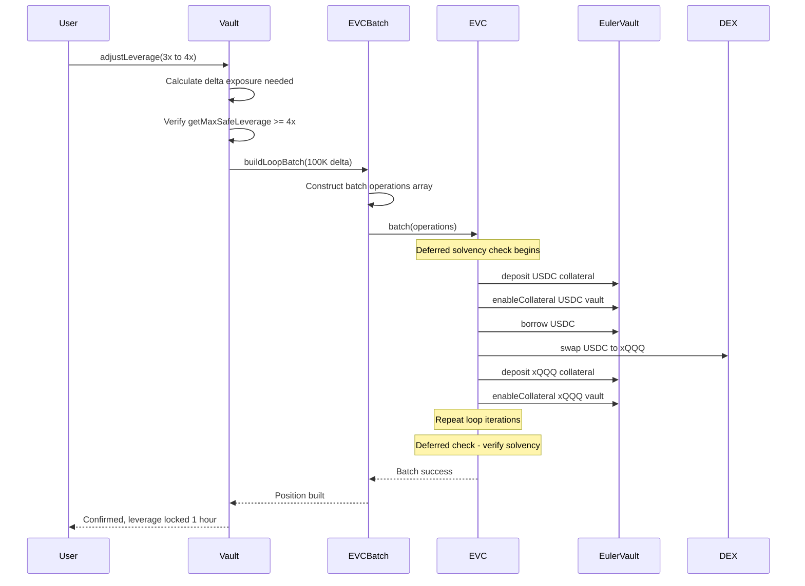
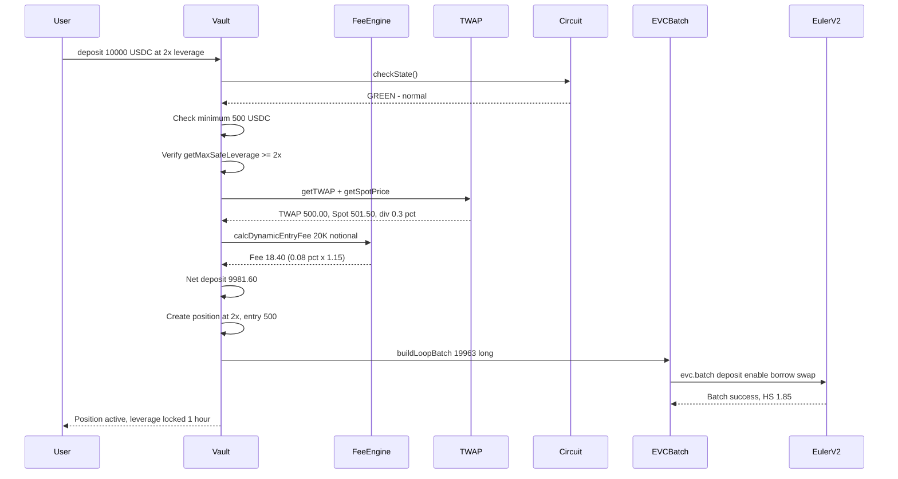
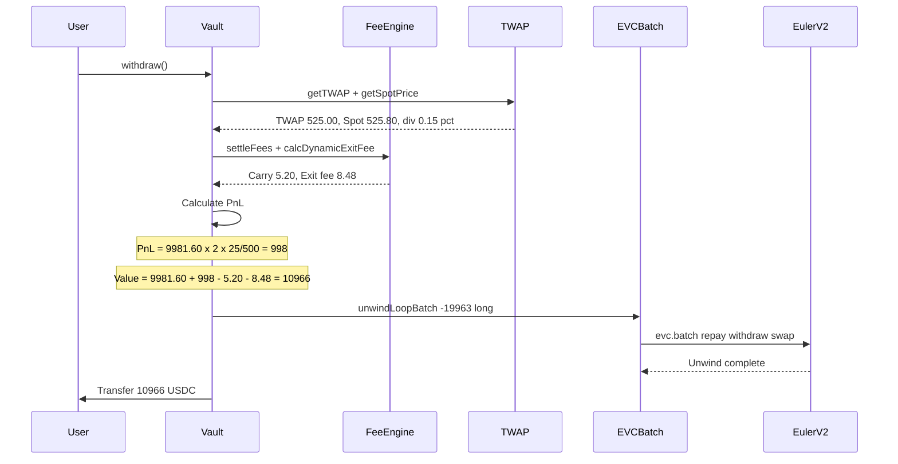

# Leveraged Tokenized Asset Protocol (LTAP)

## Architecture Document

### Executive Summary

LTAP enables continuous leverage from -4× to +4× on tokenized assets (starting with xQQQ on xStocks) without liquidation risk for users. A two-tranche system (Senior/Junior) socializes risk, with Junior absorbing first losses in exchange for fee revenue. Dynamic leverage caps, Euler V2-native hedging, and graduated circuit breakers provide robust protection against tail events.

Users hold fixed-entry leverage — no daily rebalancing, no volatility decay. Longs and shorts net out for capital efficiency. All pricing uses 15-minute TWAP from Pyth oracles with dynamic spread pricing based on spot-TWAP divergence.

**Key differentiator vs. TQQQ/SPXL:** Fixed-entry leverage outperforms daily-rebalanced ETFs in trending markets and eliminates volatility drag. Users can adjust leverage freely at any time.

**Why Euler V2:** Euler's modular vault architecture with the Ethereum Vault Connector (EVC) enables atomic looping via batched multicalls with deferred solvency checks — collapsing the entire leverage loop into a single transaction. Sub-accounts provide isolated risk management per strategy, and cross-vault collateralization maximizes capital efficiency. The EVC's deferred checks allow temporarily exceeding health factors within a batch, enabling gas-efficient leverage construction without flash loans.

---

## How It Works (Plain English)

### For Senior Users (Leverage Traders)

1. Deposit USDC, pick leverage (-4× to +4×)
2. Protocol handles all lending/borrowing on Euler V2 behind the scenes
3. Your PnL = Deposit × Leverage × (Price Change %)
4. You can increase, decrease, or exit at any time
5. Max loss = your deposit (no debt, no liquidation)

### For Junior LPs (First-Loss Capital)

1. Deposit USDC as a risk buffer protecting senior users
2. Earn fees from all senior activity (majority of protocol revenue)
3. First to absorb losses if the pool loses money
4. Can be fully wiped in extreme events — high risk, high yield

### Why No Liquidation?

Traditional leveraged lending liquidates individual users. LTAP instead socializes risk through the junior tranche — a pool of first-loss capital that absorbs drawdowns before they reach senior users. Junior LPs accept this risk in exchange for fee revenue. The protocol auto-deleverages the entire pool as health degrades, rather than liquidating individuals.

---

## System Overview

```
┌─────────────────────────────────────────────────────────────────────────────┐
│                              USER LAYER                                     │
│                                                                             │
│    ┌──────────────┐    ┌──────────────┐    ┌──────────────┐               │
│    │   Senior     │    │   Senior     │    │   Junior     │               │
│    │   User A     │    │   User B     │    │   LP         │               │
│    │   +3× Long   │    │   -2× Short  │    │   Buffer     │               │
│    └──────┬───────┘    └──────┬───────┘    └──────┬───────┘               │
│           │                   │                   │                        │
└───────────┼───────────────────┼───────────────────┼────────────────────────┘
            │                   │                   │
            ▼                   ▼                   ▼
┌─────────────────────────────────────────────────────────────────────────────┐
│                            CORE PROTOCOL                                    │
│                                                                             │
│    ┌────────────────────────────────────────────────────────────────────┐  │
│    │                         VAULT                                      │  │
│    │                                                                    │  │
│    │   ┌─────────────┐  ┌─────────────┐  ┌─────────────┐              │  │
│    │   │  Position   │  │  Exposure   │  │    Fee      │              │  │
│    │   │  Manager    │  │  Aggregator │  │  Engine     │              │  │
│    │   └─────────────┘  └─────────────┘  └─────────────┘              │  │
│    │                                                                    │  │
│    └────────────────────────────────────────────────────────────────────┘  │
│                                      │                                      │
│                                      ▼                                      │
│    ┌────────────────────────────────────────────────────────────────────┐  │
│    │                    HEDGING ENGINE                                  │  │
│    │                                                                    │  │
│    │   ┌─────────────┐  ┌─────────────┐  ┌─────────────┐              │  │
│    │   │   Euler V2  │  │   EVC       │  │   Rebalance │              │  │
│    │   │   Vault     │  │   Batch     │  │   Logic     │              │  │
│    │   │   Interface │  │   Manager   │  │             │              │  │
│    │   └─────────────┘  └─────────────┘  └─────────────┘              │  │
│    │                                                                    │  │
│    └────────────────────────────────────────────────────────────────────┘  │
│                                      │                                      │
│                                      ▼                                      │
│    ┌────────────────────────────────────────────────────────────────────┐  │
│    │                      RISK MODULE                                   │  │
│    │                                                                    │  │
│    │   ┌─────────────┐  ┌─────────────┐  ┌─────────────┐              │  │
│    │   │   Health    │  │   Auto      │  │   Circuit   │              │  │
│    │   │   Monitor   │  │   Deleverage│  │   Breaker   │              │  │
│    │   └─────────────┘  └─────────────┘  └─────────────┘              │  │
│    │                                                                    │  │
│    └────────────────────────────────────────────────────────────────────┘  │
│                                                                             │
└─────────────────────────────────────────────────────────────────────────────┘
            │                   │                   │
            ▼                   ▼                   ▼
┌─────────────────────────────────────────────────────────────────────────────┐
│                          EXTERNAL PROTOCOLS                                 │
│                                                                             │
│    ┌─────────────┐    ┌─────────────┐    ┌─────────────┐                  │
│    │  Euler V2   │    │    Pyth     │    │  Uniswap/   │                  │
│    │  EVK + EVC  │    │   Oracle    │    │  DEX        │                  │
│    │  (Vaults +  │    │   + Dynamic │    │  Aggregator │                  │
│    │  Looping)   │    │   Spread    │    │             │                  │
│    └─────────────┘    └─────────────┘    └─────────────┘                  │
│                                                                             │
└─────────────────────────────────────────────────────────────────────────────┘
```

---

## Fixed-Entry Leverage (Not Daily Rebalance)

This is a critical design choice. LTAP uses **fixed-entry leverage**, not the daily-rebalancing model used by TQQQ/SPXL.

### How TQQQ Works (Daily Rebalance)

TQQQ targets 3× of *each day's* return. Every day, the fund rebalances to reset leverage relative to that day's closing NAV. This creates **volatility decay** — in choppy markets, TQQQ underperforms 3× the cumulative QQQ return.

Example: QQQ goes +10% then -10%.
- QQQ: $100 → $110 → $99 (net -1%)
- TQQQ: $100 → $130 → $91 (net -9%, not -3%)

### How LTAP Works (Fixed Entry)

LTAP measures your PnL from your **entry price**, not from each day's close. No daily rebalance, no volatility decay.

Example: QQQ goes +10% then -10% (same sequence).
- QQQ: $100 → $110 → $99 (net -1%)
- LTAP at 3×: PnL = 3 × (-1%) = -3% of deposit (not -9%)

**Advantages:**
- No volatility decay in choppy/ranging markets
- Outperforms daily-rebalanced products in trending markets
- Simpler mental model — "2× means 2× of the move from when I entered"

**Tradeoffs:**
- In a sustained downtrend, LTAP holds full leverage the entire way down (until auto-deleverage triggers), while TQQQ would have been gradually reducing exposure via daily rebalance
- The auto-deleverage cascade compensates for this — it's the protocol-level equivalent of TQQQ's daily rebalance, but triggered by health factor thresholds rather than time

### Position Value Formula

$$
\text{Value} = D \times \left(1 + L \times \frac{P_{now} - P_{entry}}{P_{entry}}\right) - F_{accrued}
$$

Where:
- $D$ = deposit amount (USDC)
- $L$ = leverage multiplier (signed; negative for shorts)
- $P_{entry}$ = TWAP at position open or last leverage adjustment
- $P_{now}$ = current TWAP
- $F_{accrued}$ = accumulated fees

---

## Contract Architecture

### Contract Hierarchy

```
┌─────────────────────────────────────────────────────────────────┐
│                     VaultFactory                                 │
│   • Deploys new asset vaults                                    │
│   • Registry of all vaults                                      │
│   • Global protocol parameters                                  │
└─────────────────────┬───────────────────────────────────────────┘
                      │ deploys
                      ▼
┌─────────────────────────────────────────────────────────────────┐
│                      Vault (per asset)                           │
│   • Entry point for users                                       │
│   • Delegates to modules                                        │
│   • Holds USDC deposits                                         │
├─────────────────────────────────────────────────────────────────┤
│                                                                  │
│  ┌─────────────┐ ┌─────────────┐ ┌─────────────┐               │
│  │ Position    │ │ Euler       │ │ Risk        │               │
│  │ Module      │ │ Hedging     │ │ Module      │               │
│  │             │ │ Module      │ │             │               │
│  └──────┬──────┘ └──────┬──────┘ └──────┬──────┘               │
│         │               │               │                       │
│  ┌──────┴──────┐ ┌──────┴──────┐ ┌──────┴──────┐               │
│  │ TWAP        │ │ EVC Batch   │ │ Circuit     │               │
│  │ Oracle      │ │ Manager +   │ │ Breaker     │               │
│  │ + Dynamic   │ │ Sub-Account │ │ + Junior    │               │
│  │ Spread      │ │ Isolation   │ │ Tranche     │               │
│  └─────────────┘ └─────────────┘ └─────────────┘               │
│                                                                  │
└─────────────────────────────────────────────────────────────────┘
```

### Contract Descriptions

| Contract | Purpose | Key Functions |
|----------|---------|---------------|
| VaultFactory | Deploy and register vaults | `createVault()`, `getVault()`, `updateGlobalParams()` |
| Vault | Main user interface | `deposit()`, `withdraw()`, `adjustLeverage()` |
| PositionModule | Track user positions | `getPosition()`, `updatePosition()`, `applyDeleverage()` |
| FeeEngine | Dynamic fee calculation | `calcDynamicEntryFee()`, `calcContinuousFee()`, `getFundingRate()` |
| EulerHedgingModule | Manage Euler V2 positions via EVC | `hedge()`, `rebalance()`, `executeBatchLoop()` |
| RiskModule | Monitor and mitigate risk | `checkHealth()`, `autoDeleverage()`, `triggerCircuitBreaker()` |
| TWAPOracle | 15-min price averaging with dynamic spread | `getTWAP()`, `updatePrice()`, `getDynamicSpread()` |
| EVCBatchManager | Atomic looping via EVC multicall | `buildLoopBatch()`, `executeAtomicLeverage()` |
| CircuitBreaker | Emergency pause controls | `checkLimits()`, `triggerPause()`, `graduatedResponse()` |
| JuniorTranche | First-loss capital with insurance tier | `deposit()`, `withdraw()`, `absorbLoss()` |
| JuniorLPMarket | Secondary market for junior shares | `listForSale()`, `buy()`, `getDiscount()` |

---

## Data Structures

### Position

```solidity
struct Position {
    uint128 depositAmount;        // USDC deposited (6 decimals)
    int32 leverageBps;            // -40000 to +40000 (basis points)
    uint128 entryTWAP;            // TWAP at position open/adjust (8 decimals)
    uint64 lastFeeTimestamp;      // Last fee settlement time
    uint128 settledFees;          // Fees already deducted
    uint32 leverageLockExpiry;    // Earliest time to increase leverage (unix)
    bool isActive;                // Position exists
}
```

### Pool State

```solidity
struct PoolState {
    uint128 totalSeniorDeposits;    // Total senior USDC
    uint128 totalJuniorDeposits;    // Total junior USDC
    uint128 insuranceFund;          // Protocol backstop reserve
    int256 netExposure;             // Net long/short in asset terms
    uint128 grossLongExposure;      // Total long notional
    uint128 grossShortExposure;     // Total short notional
    uint64 lastRebalanceTime;       // Last hedging sync
    uint32 currentMaxLeverageBps;   // Dynamic cap based on junior ratio
    int64 fundingRateBps;           // Current funding rate (signed)
    uint8 protocolState;            // 0=active, 1=stressed, 2=paused, 3=emergency
}
```

### Euler V2 Position State

```solidity
struct EulerPosition {
    address collateralVault;        // EVK vault holding collateral (xQQQ or USDC)
    address debtVault;              // EVK vault from which we borrow
    uint256 subAccountId;           // EVC sub-account (0-255) for isolation
    uint128 collateralShares;       // Shares in collateral vault
    uint128 debtAmount;             // Borrowed amount
    uint256 healthScore;            // Euler health score (>1 = safe)
    bool isActive;                  // Position open
}
```

### TWAP Buffer with Dynamic Spread

```solidity
struct TWAPBuffer {
    uint128[75] prices;             // 15 min of 12-sec samples
    uint8 currentIndex;             // Circular buffer pointer
    uint128 runningSum;             // For O(1) average calculation
    uint64 lastUpdateTime;          // Staleness check
    uint128 lastSpotPrice;          // Latest spot for divergence check
    uint16 dynamicSpreadBps;        // Current spread based on divergence
}
```

### Circuit Breaker State

```solidity
struct CircuitBreaker {
    uint256 dailyVolume;            // Rolling 24h notional volume
    uint256 dailyVolumeLimit;       // Max notional per day
    uint256 lastJuniorValue;        // Junior NAV 24h ago
    uint256 maxDrawdownBps;         // Max daily junior drawdown
    uint256 volatility24h;          // Realized volatility
    uint256 volatilityThresholdBps; // Pause if exceeded
    uint64 lastVolumeReset;         // Daily reset timestamp
    uint8 state;                    // 0=normal, 1=warning, 2=triggered
}
```

### Slow Withdrawal

```solidity
struct SlowWithdrawal {
    address user;
    uint256 totalAmount;        // Total notional to unwind
    uint256 executedAmount;     // Amount unwound so far
    uint256 chunksRemaining;    // Number of execution chunks left
    uint64 nextExecutionTime;   // Earliest time for next chunk
    uint64 chunkInterval;       // Seconds between chunks (default: 15 min)
}
```

---

## Fee Structure (Dynamic Model)

LTAP uses a three-component fee model with **dynamic spread pricing** that prices oracle risk into trades rather than blocking them.

### Component 1: Dynamic Entry/Exit Fee (Divergence-Adjusted)

Entry/exit fees scale with spot-TWAP divergence. This prices oracle latency risk into the trade continuously rather than using binary pause/unpause states that can be gamed.

$$
\text{Fee} = \text{BaseFee} \times \left(1 + k \times |\text{Spot} - \text{TWAP}|\right)
$$

Where:
- BaseFee = 0.08% of notional (entry) or 0.04% (exit)
- $k$ = 50 (scaling factor per 1% divergence)
- At 0% divergence: fee = BaseFee (0.08%)
- At 0.5% divergence: fee = 0.08% × 1.25 = 0.10%
- At 1% divergence: fee = 0.08% × 1.50 = 0.12%
- At 2% divergence: fee = 0.08% × 2.00 = 0.16%
- At >3% divergence: transactions rejected (emergency only)

| Divergence | Entry Fee Multiplier | Effective Fee | Action |
|-----------|---------------------|---------------|--------|
| < 0.5% | 1.0-1.25× | 0.08-0.10% | Normal |
| 0.5-1.0% | 1.25-1.50× | 0.10-0.12% | Elevated, logged |
| 1.0-2.0% | 1.50-2.00× | 0.12-0.16% | Warning, max leverage reduced |
| 2.0-3.0% | 2.00-2.50× | 0.16-0.20% | Leverage capped at 2×, new longs paused |
| > 3.0% | ∞ (rejected) | — | Emergency: only withdrawals |

```solidity
function calculateDynamicFee(
    uint256 notionalDelta,
    bool isIncrease,
    uint256 spotPrice,
    uint256 twapPrice
) public view returns (uint256) {
    uint256 baseBps = isIncrease ? 8 : 4; // 0.08% or 0.04%

    uint256 divergenceBps = abs(int256(spotPrice) - int256(twapPrice)) * 10000 / twapPrice;

    // Reject if divergence > 3%
    require(divergenceBps <= 300, "Divergence too high");

    // Scale: fee = base * (1 + k * divergence)
    // k = 50 per 100bps divergence = 0.5 per 1bps
    uint256 multiplier = 10000 + (divergenceBps * 50);

    return notionalDelta * baseBps * multiplier / (10000 * 10000);
}
```

### Component 2: Continuous Carry Fee (Euler Borrow Cost Passthrough)

Rather than a fixed annual rate, the continuous fee is a passthrough of the protocol's actual borrowing costs on Euler V2, plus a small protocol spread.

$$
\text{Carry Rate} = \text{Euler Borrow Rate} \times \frac{|\text{Net Exposure}|}{\text{Gross Exposure}} + \text{Protocol Spread}
$$

The key insight: **when longs and shorts offset, the protocol's external borrowing cost drops toward zero**, and so does the carry fee. Users only pay for the hedging the protocol actually needs to do.

| Pool Balance | Net/Gross Ratio | Effective Carry |
|-------------|-----------------|-----------------|
| All long, no short | 100% | Full borrow rate + spread |
| 70% long, 30% short | 57% | 57% of borrow rate + spread |
| 50/50 balanced | 0% | Protocol spread only (~0.10%) |

Protocol spread: 0.10% annually (covers operational costs regardless of netting).

```solidity
function calculateCarryRate() public view returns (uint256 annualBps) {
    uint256 eulerBorrowRate = getEulerBorrowRate(); // From Euler V2 vault
    uint256 netExposure = abs(pool.netExposure);
    uint256 grossExposure = pool.grossLongExposure + pool.grossShortExposure;

    if (grossExposure == 0) return PROTOCOL_SPREAD_BPS; // 10 bps

    uint256 nettingRatio = netExposure * 10000 / grossExposure;
    uint256 passthrough = eulerBorrowRate * nettingRatio / 10000;

    return passthrough + PROTOCOL_SPREAD_BPS;
}
```

Per-second accrual on each user's deposit:

$$
\text{Fee per second} = \text{Deposit} \times \frac{\text{Carry Rate}}{31{,}536{,}000}
$$

### Component 3: Funding Rate (Imbalance Incentive)

A periodic payment between longs and shorts that incentivizes pool balance, similar to perpetual swap funding.

Calculated every 8 hours based on pool imbalance:

$$
\text{Funding Rate} = \text{Clamp}\left(\frac{\text{Net Exposure}}{\text{Gross Exposure}} \times \text{Max Rate},\ -0.05\%,\ +0.05\%\right)
$$

- **Positive funding** (pool is net long): longs pay shorts
- **Negative funding** (pool is net short): shorts pay longs
- **Balanced pool**: funding ≈ 0

Max funding rate: 0.05% per 8-hour period (≈ 5.5% annualized at max imbalance).

```solidity
function calculateFundingRate() public view returns (int256 rateBps) {
    int256 netExposure = pool.netExposure;
    uint256 grossExposure = pool.grossLongExposure + pool.grossShortExposure;

    if (grossExposure == 0) return 0;

    int256 rawRate = netExposure * int256(MAX_FUNDING_BPS) / int256(grossExposure);

    if (rawRate > int256(MAX_FUNDING_BPS)) return int256(MAX_FUNDING_BPS);
    if (rawRate < -int256(MAX_FUNDING_BPS)) return -int256(MAX_FUNDING_BPS);
    return rawRate;
}

function settleFunding() external {
    require(block.timestamp >= lastFundingTime + FUNDING_INTERVAL, "Too early");

    int256 rate = calculateFundingRate();
    _applyFundingToPositions(rate);

    lastFundingTime = block.timestamp;
    emit FundingSettled(rate, block.timestamp);
}
```

### Fee Distribution

```
Total Fees Collected (entry/exit + carry + funding surplus)
        │
        ├──► 70% → Junior Tranche (yield for first-loss capital)
        │
        ├──► 20% → Insurance Fund (protocol backstop)
        │
        └──► 10% → Protocol Treasury
```

### Fee Summary Example

User deposits $10K at +2× for 30 days, pool is 65% long / 35% short, divergence ≈ 0.3%:

| Component | Calculation | Amount |
|-----------|------------|--------|
| Entry fee (dynamic) | $20K × 0.08% × 1.15 | $18.40 |
| Carry fee | $10K × (3.5% × 43% + 0.10%) × 30/365 | $12.63 |
| Funding (net long, pays) | ~0.02% per 8h × 90 periods × notional share | ~$36.00 |
| Exit fee (dynamic) | $20K × 0.04% × 1.10 | $8.80 |
| **Total cost** | | **~$75.83** |

---

## Exposure Netting

Longs and shorts within the pool cancel out, reducing the protocol's external hedging requirements:

```
Example pool:
  User A: +3× on $100K = $300K long
  User B: +2× on $200K = $400K long
  User C: -2× on $150K = $300K short

  Gross long:  $700K
  Gross short: $300K
  Net exposure: $400K long

  Protocol only hedges $400K on Euler V2 (not $700K)
  Capital efficiency: 43% reduction in external positions

  Carry fee scales to 400/1000 = 40% of borrow rate
  (vs. 100% if no netting)
```

Net exposure calculation:

$$
\text{Net} = \sum_{i} D_i \times L_i
$$

Where $L_i$ is signed (negative for shorts).

---

## Dynamic Leverage Caps

Maximum leverage scales with junior tranche health:

| Junior Ratio | Max Leverage | Minimum Buffer |
|--------------|------------|----------------|
| ≥ 40% | 4.0× (40000 bps) | 25% |
| 30-39% | 3.0× (30000 bps) | 33% |
| 20-29% | 2.0× (20000 bps) | 50% |
| < 20% | 1.5× (15000 bps) | 67% |

```solidity
function calculateMaxLeverage(uint256 juniorRatio) public pure returns (int32) {
    if (juniorRatio >= 4000) return 40000;      // 40% = 4×
    if (juniorRatio >= 3000) return 30000;      // 30% = 3×
    if (juniorRatio >= 2000) return 20000;      // 20% = 2×
    return 15000;                               // <20% = 1.5×
}
```

### Leverage Lock Periods

Prevent toxic flow from rapid leverage switching:

| Action | Delay | Rationale |
|--------|-------|-----------|
| Leverage increase | 1 hour | Prevent front-running volatility |
| Leverage decrease | None | Always allow risk reduction |
| Full exit | None | Emergency liquidity |
| Flip long/short | 4 hours | Prevent wash trading |

---

## Hedging Engine: Euler V2 Integration

### Why Euler V2

Euler V2's modular vault architecture provides critical advantages for LTAP's hedging engine:

- **Atomic looping:** The EVC's deferred solvency checks allow the entire leverage loop to execute in a single `evc.batch()` call — no flash loans, no multi-transaction sequences
- **Risk isolation:** Sub-accounts (256 per address) isolate long hedges, short hedges, and insurance yield into separate risk profiles
- **Deterministic leverage caps:** Single vault LTV parameters are known and queryable on-chain, so the protocol can verify the exact achievable leverage before accepting a deposit
- **Collateral rehypothecation:** Euler vaults allow lending out collateral while it's being used as collateral, improving capital efficiency
- **Single governance surface:** One protocol to monitor for parameter changes, upgrades, and risk events

### Atomic Looping via EVC Multicall

The EVC's deferred solvency check is the key primitive. Within a single `evc.batch()` call, we can temporarily exceed health requirements — the only check is that the account is solvent at the end of the batch. This allows constructing a full leverage position in one transaction without flash loans.

**For net long exposure (atomic loop):**

```
EVC.batch([
    1. Deposit USDC into Euler USDC collateral vault (sub-account 0)
    2. Enable USDC vault as collateral for xQQQ debt vault
    3. Borrow USDC from xQQQ-denominated debt vault
    4. Swap USDC → xQQQ on DEX
    5. Deposit xQQQ into Euler xQQQ collateral vault (sub-account 0)
    6. Enable xQQQ vault as additional collateral
    7. Repeat steps 3-6 for loop iterations
    // Solvency check deferred until here — all checks pass at batch end
])
```

**For net short exposure (atomic loop):**

```
EVC.batch([
    1. Deposit USDC into Euler USDC collateral vault (sub-account 1)
    2. Enable USDC vault as collateral
    3. Borrow xQQQ from Euler xQQQ vault
    4. Swap xQQQ → USDC on DEX
    5. Deposit additional USDC as collateral
    6. Repeat steps 3-5 for loop iterations
    // Solvency check deferred until here
])
```

### Slippage Protection in Batch Execution

Every DEX swap inside the EVC batch includes an explicit slippage check. If liquidity is too thin (e.g., during a black swan), the batch reverts entirely rather than executing at a terrible rate and destroying user capital.

```solidity
uint256 constant MAX_SLIPPAGE_BPS = 200; // 2% max slippage per swap

function executeSwapWithSlippageCheck(
    address tokenIn,
    address tokenOut,
    uint256 amountIn,
    uint256 expectedOut // calculated from TWAP
) internal returns (uint256 amountOut) {
    uint256 minOut = expectedOut * (10000 - MAX_SLIPPAGE_BPS) / 10000;

    amountOut = dexRouter.swap(tokenIn, tokenOut, amountIn, minOut);
    // dexRouter.swap reverts if amountOut < minOut

    return amountOut;
}
```

**When slippage exceeds 2%:**

| Scenario | Action |
|----------|--------|
| Deposit / leverage increase | Batch reverts, user retains USDC, no position opened |
| Withdrawal / leverage decrease | Batch reverts, user enters "slow withdrawal" queue |
| ADL forced deleverage | Batch reverts, retry after 5 blocks with fresh quote |

**Slow Withdrawal Queue:** When instant withdrawal reverts due to slippage, the user's withdrawal is queued for TWAP execution over 4-24 hours (configurable by governance). The protocol splits the position unwind into smaller chunks executed across multiple blocks, minimizing market impact.

```solidity
struct SlowWithdrawal {
    address user;
    uint256 totalAmount;        // Total notional to unwind
    uint256 executedAmount;     // Amount unwound so far
    uint256 chunksRemaining;    // Number of execution chunks left
    uint64 nextExecutionTime;   // Earliest time for next chunk
    uint64 chunkInterval;       // Seconds between chunks (default: 15 min)
}

function queueSlowWithdrawal(address user) internal {
    Position memory pos = positions[user];
    uint256 notional = pos.depositAmount * abs(pos.leverageBps) / 10000;

    // Split into chunks: 1 chunk per $50K notional, min 4, max 96 (24 hours at 15 min)
    uint256 chunks = max(4, min(96, notional / 50_000e6));

    slowWithdrawals[user] = SlowWithdrawal({
        user: user,
        totalAmount: notional,
        executedAmount: 0,
        chunksRemaining: chunks,
        nextExecutionTime: uint64(block.timestamp + 15 minutes),
        chunkInterval: 15 minutes
    });

    emit SlowWithdrawalQueued(user, notional, chunks);
}

function executeSlowWithdrawalChunk(address user) external onlyKeeper {
    SlowWithdrawal storage sw = slowWithdrawals[user];
    require(sw.chunksRemaining > 0, "No pending withdrawal");
    require(block.timestamp >= sw.nextExecutionTime, "Too early");

    uint256 chunkSize = (sw.totalAmount - sw.executedAmount) / sw.chunksRemaining;

    // Attempt swap with normal slippage check
    // If this chunk also reverts, keeper retries next interval
    _unwindChunk(user, chunkSize);

    sw.executedAmount += chunkSize;
    sw.chunksRemaining -= 1;
    sw.nextExecutionTime = uint64(block.timestamp + sw.chunkInterval);

    if (sw.chunksRemaining == 0) {
        _finalizeWithdrawal(user);
        delete slowWithdrawals[user];
    }
}
```

### Achievable Leverage vs. LTV

**Critical: Explicit leverage cap based on Euler vault LTV.**

For a single-asset loop, the theoretical max leverage is:

$$
L_{max} = \frac{1}{1 - \text{LTV}}
$$

| Asset LTV | Max Loop Leverage | Safe Operating Leverage |
|-----------|-------------------|------------------------|
| 75% | 4.00× | 3.00× |
| 80% | 5.00× | 3.50× |
| 82.5% | 5.71× | 4.00× |
| 85% | 6.67× | 4.50× |

For LTAP's 4× max leverage, we need an Euler vault with ≥ 82.5% borrow LTV for xQQQ/USDC. The protocol **will not accept deposits requesting leverage that exceeds the safe operating limit** based on the current Euler vault parameters.

```solidity
function getMaxSafeLeverage() public view returns (uint256) {
    uint256 borrowLTV = eulerVault.getLTV(xQQQVault, usdcVault); // bps
    uint256 theoreticalMax = 10000 * 10000 / (10000 - borrowLTV); // 1/(1-LTV)
    // Apply 70% safety margin to theoretical max
    return theoreticalMax * 7000 / 10000;
}
```

**If `getMaxSafeLeverage()` returns less than 4×, the protocol dynamically caps leverage to what the Euler vault can actually support.** The protocol never promises leverage it can't hedge.

### Euler LTV Change Monitoring

Euler governance can change vault LTV parameters at any time. If LTV drops (e.g., from 82.5% to 70%), existing positions may become undercollateralized even without any price movement. The protocol monitors for this and forces rebalancing when needed.

```solidity
uint256 public lastKnownLTV;

function checkLTVChange() external {
    uint256 currentLTV = eulerVault.getLTV(xQQQVault, usdcVault);

    if (currentLTV < lastKnownLTV) {
        uint256 newMaxLev = getMaxSafeLeverage();

        // Force-deleverage any positions exceeding the new max
        _forceDeleverageAboveCap(newMaxLev);

        emit LTVChanged(lastKnownLTV, currentLTV, newMaxLev);
    }

    lastKnownLTV = currentLTV;
}

function _forceDeleverageAboveCap(uint256 newMaxLevBps) internal {
    // Iterate active positions, reduce any that exceed newMaxLevBps
    // Users are not penalized — this is a protocol-level parameter change,
    // not a user fault. No fees on forced reduction.
    // Positions are reduced to newMaxLevBps with entry price reset to current TWAP.
}
```

This is called by the keeper on every rebalance cycle (every 4 hours) and can also be triggered permissionlessly by anyone. If Euler LTV drops suddenly, any user or MEV bot can call `checkLTVChange()` to protect the pool.

### Sub-Account Isolation

Euler V2 provides 256 sub-accounts per address. LTAP uses them for strategy isolation:

| Sub-Account | Purpose | Risk Profile |
|------------|---------|-------------|
| 0 | Net long hedging | xQQQ collateral, USDC debt |
| 1 | Net short hedging | USDC collateral, xQQQ debt |
| 2 | Insurance fund yield | External protocol (e.g., Aave USDC vault) |
| 3-10 | Reserved for future strategies | — |

If the long position in sub-account 0 gets liquidated on Euler, it does **not** affect the short hedge in sub-account 1 or the insurance fund in sub-account 2.

### Leverage Construction Flow



### Batch Rebalancing

Optimize gas for multiple user adjustments:

```solidity
function batchRebalance(UserAdjustment[] calldata adjustments) external onlyKeeper {
    int256 netDelta;
    for (uint i; i < adjustments.length; i++) {
        netDelta += adjustments[i].exposureDelta;
        updatePosition(adjustments[i].user, adjustments[i].newLeverage);
    }

    // Single EVC batch for net position change
    if (netDelta != 0) {
        bytes[] memory ops = buildLoopBatch(netDelta > 0, abs(netDelta));
        evc.batch(ops);
    }

    emit BatchRebalance(adjustments.length, netDelta);
}
```

### Rebalancing Triggers

| Trigger | Threshold | Action |
|---------|-----------|--------|
| Leverage drift | ±10% from target | Rebalance to target |
| Health score low | < 1.5 | Reduce exposure |
| Health score critical | < 1.3 | Emergency deleverage |
| Large user adjustment | > 5% of pool | Immediate hedge |
| Time-based | Every 4 hours | Sync if drift > 2% |

---

## Risk Module

### Health Factor Monitoring

LTAP monitors the Euler V2 health score per sub-account:

$$
\text{Health Score} = \frac{\text{Risk-Adjusted Collateral Value}}{\text{Liability Value}}
$$

Euler V2 computes this using per-vault LTV factors and oracle pricing. LTAP reads it directly:

```solidity
function getEulerHealthScore(uint256 subAccountId) public view returns (uint256) {
    address subAccount = getSubAccountAddress(subAccountId);
    return eulerLens.getHealthScore(subAccount);
}
```

### Auto-Deleverage Cascade (Randomized)

When health score drops, automatic deleveraging kicks in. ADL execution uses commit-reveal randomization to prevent front-running.

**The Problem:** ADL at fixed thresholds creates predictable sell pressure visible on-chain. Sophisticated actors can short before the cascade, amplifying the dump. Additionally, an attacker can artificially trigger ADL by manipulating Euler borrow rates (depositing then borrowing massively to spike interest, pushing the health score below threshold without any actual price movement).

**The Fix:** Two-phase ADL with randomized execution delay and compound trigger conditions. ADL only fires when the health score drop is corroborated by actual market movement — a health score dip caused purely by interest rate spikes is handled by rebalancing, not forced selling.

```
Phase 1 (Commit): Keeper submits ADL trigger hash
Phase 2 (Reveal + Execute): After random delay (1-10 blocks),
  keeper reveals and executes ADL

Compound trigger (must satisfy BOTH):
  - Health Score < threshold, AND
  - Price drop > 5% from 24h high OR realized volatility > 60% annualized
  
If HS < threshold but price/vol conditions not met:
  - Rebalance only (reduce Euler positions, don't force-deleverage users)
```

The random delay is derived from the blockhash at commit time:

```solidity
function commitADL(uint256 level) external onlyKeeper {
    // Compound trigger: HS alone is not sufficient — prevents interest rate manipulation
    uint256 hs = getEulerHealthScore(0);
    uint256 priceDropBps = getPriceDropFrom24hHigh();
    uint256 realizedVol = getRealized24hVolatility();

    bool hsTriggered = (level == 1 && hs < 1.4e18) ||
                       (level == 2 && hs < 1.3e18) ||
                       (level >= 3 && hs < 1.1e18);

    bool marketTriggered = priceDropBps > 500 || realizedVol > 6000; // 5% drop or 60% vol

    // Levels 1-2: require both HS + market condition (prevents rate manipulation)
    // Levels 3+: HS alone is sufficient (emergency, can't wait for confirmation)
    require(hsTriggered, "HS threshold not met");
    if (level <= 2) {
        require(marketTriggered, "No market confirmation — rebalance instead");
    }

    bytes32 commitHash = keccak256(abi.encodePacked(level, msg.sender, block.timestamp));
    adlCommit = ADLCommit({
        hash: commitHash,
        level: level,
        commitBlock: block.number,
        minDelay: 1 + uint256(blockhash(block.number - 1)) % 10 // 1-10 blocks
    });
    emit ADLCommitted(commitHash);
}

function executeADL(uint256 level) external onlyKeeper {
    require(block.number >= adlCommit.commitBlock + adlCommit.minDelay, "Too early");
    require(keccak256(abi.encodePacked(level, msg.sender, adlCommit.commitBlock))
        == adlCommit.hash, "Invalid reveal");

    _executeDeleverage(level);
    delete adlCommit;
}
```

### ADL Levels

```
┌─────────────────────────────────────────────────────────────┐
│                 AUTO-DELEVERAGE CASCADE                       │
├─────────────────────────────────────────────────────────────┤
│                                                              │
│   HS > 1.5          Normal operation                         │
│       │                                                      │
│       ▼                                                      │
│   HS 1.4-1.5        Warning: increase monitoring             │
│       │                                                      │
│       ▼                                                      │
│   HS 1.3-1.4        Level 1: Reduce all leverage by 25%     │
│       │              (commit-reveal, 1-10 block delay)       │
│       ▼                                                      │
│   HS 1.2-1.3        Level 2: Reduce all leverage by 50%     │
│       │              (commit-reveal, 1-5 block delay)        │
│       ▼                                                      │
│   HS 1.1-1.2        Level 3: Reduce to max 1.5× leverage    │
│       │              (immediate, no delay)                   │
│       ▼                                                      │
│   HS < 1.1          Level 4: Full exit to 1× (spot only)    │
│       │              (immediate, emergency)                  │
│       ▼                                                      │
│   HS < 1.05         Level 5: Emergency unwind, pause all    │
│                                                              │
└─────────────────────────────────────────────────────────────┘
```

Proportional reduction formula:

$$
L_{new} = 1 + (L_{old} - 1) \times \text{reduction factor}
$$

Example at Level 1 (25% reduction):
- User at +4×: new = 1 + (4-1) × 0.75 = 3.25×
- User at +3×: new = 1 + (3-1) × 0.75 = 2.5×
- User at -2×: new = 1 + (-2-1) × 0.75 = -1.25×
- User at +1×: unchanged (no excess leverage to reduce)

### Circuit Breaker System

| Level | Trigger | Response |
|-------|---------|----------|
| Green | Normal operation | All functions active |
| Yellow | Divergence > 1% OR vol > 50% | Dynamic fees kick in (see fee table above) |
| Orange | Junior drawdown > 15% OR HS < 1.3 | Pause leverage increases, force deleverage |
| Red | Junior drawdown > 30% OR HS < 1.1 | Full pause, emergency withdraw only |
| Black | Protocol insolvency risk | Emergency unwind, pro-rata distribution |

### Loss Waterfall (Deposit-Share Proportional)

When losses breach the junior + insurance buffer and reach senior users, losses are socialized by **deposit share**, not by notional exposure share.

**Rationale:** If loss were proportional to `|D_i × L_i|` (notional), a conservative 1× user would subsidize the risk of a 4× user — even though the 4× user already pays more in carry fees. Socializing by deposit share is equitable: each user risks the same percentage of their capital regardless of leverage.

```
┌─────────────────────────────────────────────────────────────┐
│                     LOSS WATERFALL                            │
├─────────────────────────────────────────────────────────────┤
│                                                              │
│                     Pool Loss Occurs                         │
│                           │                                  │
│                           ▼                                  │
│   ┌─────────────────────────────────────────────────────┐   │
│   │              JUNIOR TRANCHE (First Loss)             │   │
│   │                                                      │   │
│   │   If loss ≤ junior capacity:                        │   │
│   │     Junior reduced by loss amount                    │   │
│   │     Senior untouched                                 │   │
│   │                                                      │   │
│   │   If loss > junior capacity:                        │   │
│   │     Junior wiped to zero                            │   │
│   │     Excess flows to insurance                       │   │
│   └─────────────────────────────────────────────────────┘   │
│                           │                                  │
│                           ▼ (excess only)                    │
│   ┌─────────────────────────────────────────────────────┐   │
│   │              INSURANCE FUND (Second Loss)            │   │
│   │                                                      │   │
│   │   If loss ≤ insurance capacity:                     │   │
│   │     Insurance absorbs remainder                      │   │
│   │     Senior untouched                                 │   │
│   │                                                      │   │
│   │   If loss > insurance:                              │   │
│   │     Insurance depleted                               │   │
│   │     Excess flows to senior                           │   │
│   └─────────────────────────────────────────────────────┘   │
│                           │                                  │
│                           ▼ (excess only)                    │
│   ┌─────────────────────────────────────────────────────┐   │
│   │        SENIOR POSITIONS (Last Resort)                │   │
│   │       Socialized pro-rata by DEPOSIT SHARE           │   │
│   │                                                      │   │
│   │   Loss per user = excess × (user deposit / total)    │   │
│   │                                                      │   │
│   │   NOT by notional — 1× and 4× users lose the same  │   │
│   │   percentage of their deposit.                       │   │
│   └─────────────────────────────────────────────────────┘   │
│                                                              │
└─────────────────────────────────────────────────────────────┘
```

Loss attribution formula for senior users (only after junior + insurance exhausted):

$$
\text{Loss}_i = \text{Excess Loss} \times \frac{D_i}{\sum_j D_j}
$$

### Naked Short Exposure Check

The protocol explicitly checks available Euler vault liquidity before accepting new short positions:

```solidity
function validateShortCapacity(uint256 newShortNotional) internal view {
    uint256 availableLiquidity = eulerVault.totalAssets() - eulerVault.totalBorrows();
    uint256 currentShortExposure = pool.grossShortExposure - min(pool.grossShortExposure, pool.grossLongExposure);
    uint256 netNewShort = currentShortExposure + newShortNotional;

    require(netNewShort <= availableLiquidity * 80 / 100, "Insufficient short liquidity");
}
```

If net short exposure exceeds 80% of available lending liquidity on Euler, new shorts are paused. **The protocol cannot hedge a short if it cannot borrow the underlying asset.**

### Underwater Position Handling

When a user's position value goes negative:

```
Position value = Deposit + PnL - Fees

If value ≤ 0:
  1. Position automatically closed
  2. Loss = |negative value| + deposit
  3. Loss flows through waterfall (junior → insurance → senior)
  4. User's position deleted
  5. No debt owed by user
  6. User can re-enter with fresh deposit
```

---

## TWAP Oracle with Dynamic Spread

15-minute time-weighted average price from Pyth with continuous spread pricing:

```
Price samples: Every 12 seconds (1 block)
Buffer size: 75 samples (75 × 12s = 900s = 15 min)
Update: Permissionless, anyone can call

Calculation:
  TWAP = sum(prices[0..74]) / 75

On new price:
  runningSum = runningSum - prices[oldestIndex] + newPrice
  prices[currentIndex] = newPrice
  currentIndex = (currentIndex + 1) % 75
```

Dynamic spread (replaces old hard pause thresholds):

| Spot-TWAP Spread | Dynamic Fee Impact | Additional Action |
|------------------|-------------------|-------------------|
| < 0.5% | 1.0-1.25× base fee | Normal operation |
| 0.5-1.0% | 1.25-1.50× base fee | Warning logged |
| 1.0-2.0% | 1.50-2.00× base fee | Max leverage reduced to 2× |
| 2.0-3.0% | 2.00-2.50× base fee | New positions paused, only exits |
| > 3.0% | Transactions rejected | Emergency oracle fallback |

Staleness protection:

| Condition | Action |
|-----------|--------|
| Fresh (< 5 min old) | Normal operation |
| Stale (5-15 min) | Warning, allow withdrawals only |
| Very stale (> 15 min) | Pause all operations except emergency |

---

## Junior Tranche

### Purpose

Junior tranche provides first-loss capital protecting senior users. In exchange, junior earns the majority of all protocol fees. This is the mechanism that makes "no user liquidation" possible.

### Economics

```
┌─────────────────────────────────────────────────────────────┐
│                  JUNIOR ECONOMICS                            │
├─────────────────────────────────────────────────────────────┤
│                                                              │
│   Revenue:                                                   │
│   ├── 70% of all protocol fees (entry/exit + carry)         │
│   ├── Yield from insurance fund (20% of fees)               │
│   └── Net funding rate surplus (if any)                     │
│                                                              │
│   Risk:                                                      │
│   ├── First to absorb any pool losses                       │
│   ├── Can be fully wiped in severe crash                    │
│   └── Locked during stress events (HS < 1.4)               │
│                                                              │
│   Target Metrics:                                            │
│   ├── Junior ratio: 25-45% of pool                          │
│   ├── Target APY: 12-35% depending on utilization           │
│   └── Max drawdown: 100% (can be wiped)                     │
│                                                              │
│   Insurance Fund:                                            │
│   ├── 20% of fees accumulate here                           │
│   ├── Caps at 10% of total junior deposits                  │
│   ├── Excess distributed to junior LPs                      │
│   └── Deployed to external protocol (Aave) for yield —      │
│        MUST NOT share liquidity with hedging engine          │
│                                                              │
└─────────────────────────────────────────────────────────────┘
```

### Junior LP Secondary Market

Junior LPs can be "trapped" during stress events (withdrawals paused when HS < 1.4). Rather than forcing a protocol withdrawal that damages the health factor, LTAP implements a secondary market for junior LP shares.

```solidity
struct JuniorListing {
    address seller;
    uint256 shares;
    uint256 discountBps;    // Discount from NAV (e.g., 500 = 5% discount)
    uint64 expiry;          // Listing expiry timestamp
    uint64 createdAt;       // When listing was created (for forced withdrawal timer)
    bool isActive;
}

function listJuniorForSale(uint256 shares, uint256 discountBps) external {
    require(discountBps <= 5000, "Max 50% discount");
    require(juniorTranche.balanceOf(msg.sender) >= shares, "Insufficient shares");

    listings[nextListingId++] = JuniorListing({
        seller: msg.sender,
        shares: shares,
        discountBps: discountBps,
        expiry: uint64(block.timestamp + 24 hours),
        createdAt: uint64(block.timestamp),
        isActive: true
    });

    emit JuniorListed(msg.sender, shares, discountBps);
}

function buyJuniorListing(uint256 listingId) external {
    JuniorListing storage listing = listings[listingId];
    require(listing.isActive && block.timestamp < listing.expiry, "Invalid listing");

    uint256 nav = juniorTranche.sharePrice() * listing.shares / 1e18;
    uint256 price = nav * (10000 - listing.discountBps) / 10000;

    // Transfer USDC from buyer to seller
    usdc.transferFrom(msg.sender, listing.seller, price);
    // Transfer junior shares from seller to buyer
    juniorTranche.transferFrom(listing.seller, msg.sender, listing.shares);

    listing.isActive = false;
    emit JuniorSold(listingId, msg.sender, price);
}
```

**Why this matters:** During stress, desperate junior LPs can find exit liquidity from buyers willing to take a discounted risk-on position, without withdrawing from the protocol and worsening the health factor. New buyers get a discount for entering during stress — a natural market for distressed debt.

### Forced Withdrawal with Haircut (Last Resort)

If a junior LP's shares have been listed on the secondary market for 7 days with no buyer, the LP can trigger a forced withdrawal at a fixed -30% NAV discount. This prevents permanent trapping in dead markets.

```solidity
uint256 constant FORCED_WD_DELAY = 7 days;
uint256 constant FORCED_WD_HAIRCUT_BPS = 3000; // 30% discount

function forceWithdrawJunior(uint256 listingId) external {
    JuniorListing storage listing = listings[listingId];
    require(listing.seller == msg.sender, "Not your listing");
    require(listing.isActive, "Listing not active");
    require(block.timestamp >= listing.createdAt + FORCED_WD_DELAY, "Too early — 7 day minimum");

    uint256 nav = juniorTranche.sharePrice() * listing.shares / 1e18;
    uint256 payout = nav * (10000 - FORCED_WD_HAIRCUT_BPS) / 10000;

    // Withdraw from junior tranche at haircut price
    juniorTranche.forceRedeem(listing.shares, payout);

    // Transfer discounted amount to LP
    usdc.transfer(msg.sender, payout);

    // The haircut (30% of NAV) stays in the junior tranche as a buffer
    listing.isActive = false;
    emit ForcedWithdrawal(msg.sender, listing.shares, payout, nav - payout);
}
```

The 30% haircut is intentionally punitive — it should be a last resort after the secondary market fails. The retained haircut amount stays in the junior tranche as additional buffer for the remaining LPs.

### Withdrawal Mechanics

Junior withdrawals are instant (during normal operation) with a utilization-adjusted fee:

```
Utilization = Senior Deposits / (Junior Deposits × Max Senior Ratio)

If utilization < 50%:  fee = 0.5%
If utilization 50-75%: fee = 0.5% + (util - 50%) × 0.02 = 0.5-1.0%
If utilization 75-90%: fee = 1.0% + (util - 75%) × 0.067 = 1.0-2.0%
If utilization > 90%:  fee = 5% (discourage withdrawal when buffer needed)
```

During stress (HS < 1.4 or circuit breaker ≥ ORANGE):

```
Junior withdrawals paused until:
  - HS > 1.5 for 1 hour, AND
  - Circuit breaker state = GREEN

Alternative: Use Junior LP Secondary Market (see above)
```

---

## User Flows

### Senior Deposit and Set Leverage



### Withdraw with PnL



---

## Worked Example: 2× Long on xQQQ

### Setup

- Deposit: $10,000 USDC
- Leverage: +2×
- Entry TWAP: $500.00
- Entry fee: $20K × 0.08% × 1.15 (0.3% divergence) = $18.40 → effective deposit = $9,981.60
- Notional exposure: $19,963
- Hold period: 30 days

### Scenario Outcomes

| Scenario | xQQQ Move | Price | PnL | Carry + Funding | Exit Fee | You Receive | Return |
|----------|-----------|-------|-----|-----------------|----------|-------------|--------|
| Strong rally | +20% | $600 | +$3,993 | −$18 | −$8 | **$13,948** | **+39.5%** |
| Solid gain | +10% | $550 | +$1,996 | −$18 | −$8 | **$11,952** | **+19.5%** |
| Modest gain | +5% | $525 | +$998 | −$18 | −$8 | **$10,954** | **+9.5%** |
| Flat | 0% | $500 | $0 | −$18 | −$8 | **$9,956** | **−0.4%** |
| Mild dip | −5% | $475 | −$998 | −$18 | −$8 | **$8,958** | **−10.4%** |
| Correction | −10% | $450 | −$1,996 | −$18 | −$8 | **$7,960** | **−20.4%** |
| Crash | −25% | $375 | −$4,991 | −$18 | −$8 | **$4,965** | **−50.4%** |
| Black swan | −50% | $250 | −$9,982 | — | — | **≈ $0** | **−100%** |

Note: Carry + funding assumes moderately net-long pool. Actual costs vary with pool balance and Euler borrow rates.

### What Happens at −50% (Position Wipeout)

At 2× leverage, a −50% move in xQQQ zeroes your position. The protocol:

1. Automatically closes your position
2. You lose your $9,982 effective deposit — **nothing more, no debt**
3. Any loss beyond your deposit flows into the loss waterfall
4. Junior tranche absorbs first, then insurance fund, then other seniors (by deposit share)

### What the Auto-Deleverage Does on the Way Down

In a slow decline (not a gap), the auto-deleverage cascade intervenes before you reach −50%:

| xQQQ Drop | Your Position | Protocol Action |
|-----------|---------------|-----------------|
| −15% | $6,988 (−30%) | Normal — HS still healthy |
| −20% | $5,989 (−40%) | HS approaching 1.4, monitoring increases |
| −25% | $4,991 (−50%) | HS ~1.3, Level 1: leverage cut to ~1.75× (randomized delay) |
| −30% | ~$4,200 | HS ~1.2, Level 2: leverage forced to ~1.5× |
| −35% | ~$3,500 | HS ~1.1, Level 3: everything forced to 1.5× max (immediate) |
| −40% | ~$3,000 | HS < 1.1, Level 4: forced to 1× (spot only, immediate) |

So in practice, a grinding decline triggers progressive deleveraging that preserves more of your capital than riding 2× all the way down. The full −50% = −100% wipeout scenario requires a sudden gap move (flash crash, overnight gap) where the cascade can't react in time.

---

## Comparison: LTAP vs. TQQQ

| Feature | TQQQ (Leveraged ETF) | LTAP |
|---------|---------------------|------|
| Leverage | Fixed 3× daily | Adjustable 1-4×, fixed-entry |
| Rebalancing | Daily (causes vol decay) | None (auto-deleverage on risk only) |
| Volatility decay | Yes — significant in choppy markets | No |
| Liquidation risk | None (but can go to ~$0) | None (max loss = deposit) |
| Fee | 0.95% annual mgmt fee | Dynamic: ~0.08-0.20% trade + carry passthrough |
| Adjust leverage | Can't — always 3× | Freely, anytime |
| Short exposure | Need SQQQ (separate product) | Built in: -1× to -4× |
| Settlement | T+1 through broker | Instant on-chain via Euler V2 |
| Loss protection | None | Junior tranche + insurance fund |
| Hours | Market hours only | 24/7 |
| Hedging backend | Fund manager discretion | Euler V2 atomic looping |

---

## Contract Interfaces

### IVault

```solidity
interface IVault {
    // Senior user functions
    function deposit(uint256 amount, int32 leverageBps) external;
    function withdraw() external returns (uint256);
    function adjustLeverage(int32 newLeverageBps) external;

    // Slow withdrawal (when instant withdrawal reverts due to slippage)
    function getSlowWithdrawal(address user) external view returns (SlowWithdrawal memory);
    function executeSlowWithdrawalChunk(address user) external;

    // Junior LP functions
    function depositJunior(uint256 amount) external returns (uint256 shares);
    function withdrawJunior(uint256 shares) external returns (uint256 amount);

    // View functions
    function getPosition(address user) external view returns (Position memory);
    function getPositionValue(address user) external view returns (uint256);
    function getTWAP() external view returns (uint256);
    function getPoolState() external view returns (PoolState memory);
    function getEulerHealthScore() external view returns (uint256);
    function getMaxSafeLeverage() external view returns (uint256);
    function getCurrentMaxLeverage() external view returns (int32);
    function getFundingRate() external view returns (int256);

    // Events
    event Deposit(address indexed user, uint256 amount, int32 leverageBps, uint256 entryPrice);
    event Withdraw(address indexed user, uint256 amount, int256 pnl);
    event LeverageAdjusted(address indexed user, int32 oldLev, int32 newLev);
    event FundingSettled(int256 rate, uint256 timestamp);
    event JuniorDeposit(address indexed lp, uint256 amount, uint256 shares);
    event JuniorWithdraw(address indexed lp, uint256 shares, uint256 amount, uint256 fee);
    event AutoDeleverage(uint256 level, uint256 oldHS, uint256 newHS);
    event CircuitBreakerTriggered(uint8 newState);
    event LossAbsorbed(uint256 amount, uint256 juniorUsed, uint256 insuranceUsed, uint256 seniorLoss);
    event SlowWithdrawalQueued(address indexed user, uint256 notional, uint256 chunks);
    event SlowWithdrawalComplete(address indexed user, uint256 totalPayout);
    event LTVChanged(uint256 oldLTV, uint256 newLTV, uint256 newMaxLeverage);
}
```

### IFeeEngine

```solidity
interface IFeeEngine {
    function calcDynamicEntryFee(uint256 notionalDelta, uint256 divergenceBps) external view returns (uint256);
    function calcDynamicExitFee(uint256 notionalDelta, uint256 divergenceBps) external view returns (uint256);
    function calcCarryRate() external view returns (uint256 annualBps);
    function calcFundingRate() external view returns (int256 rateBps);
    function settleFees(address user) external returns (uint256 feesDeducted);
    function settleFunding() external;
    function getAccruedFees(address user) external view returns (uint256);
}
```

### IEulerHedgingModule

```solidity
interface IEulerHedgingModule {
    function updateExposure(int256 exposureDelta) external;
    function rebalance() external;
    function buildLoopBatch(bool isLong, uint256 amount) external view returns (bytes[] memory ops);
    function executeBatchLoop(bytes[] calldata ops) external;
    function batchRebalance(UserAdjustment[] calldata adjustments) external;
    function getEulerPosition(uint256 subAccountId) external view returns (EulerPosition memory);
    function getNetExposure() external view returns (int256);
    function getEulerHealthScore(uint256 subAccountId) external view returns (uint256);
    function getMaxSafeLeverage() external view returns (uint256);
    function validateShortCapacity(uint256 newShortNotional) external view;
}
```

### IRiskModule

```solidity
interface IRiskModule {
    function checkHealth() external view returns (uint256 healthScore);
    function shouldDeleverage() external view returns (bool, uint256 level);
    function commitADL(uint256 level) external;
    function executeADL(uint256 level) external;
    function checkCircuitBreaker() external;
    function checkLTVChange() external;
    function absorbLoss(uint256 amount) external returns (uint256 juniorLoss, uint256 insuranceUsed, uint256 seniorLoss);
    function isJuniorWithdrawAllowed() external view returns (bool);
    function getJuniorWithdrawFee() external view returns (uint256 feeBps);
    function getPriceDropFrom24hHigh() external view returns (uint256 bps);
    function getRealized24hVolatility() external view returns (uint256 bps);
}
```

### ITWAPOracle

```solidity
interface ITWAPOracle {
    function updatePrice() external;
    function getTWAP() external view returns (uint256);
    function getSpotPrice() external view returns (uint256);
    function getDivergenceBps() external view returns (uint256);
    function getDynamicSpreadMultiplier() external view returns (uint256);
    function isFresh() external view returns (bool);
}
```

### IJuniorTranche

```solidity
interface IJuniorTranche {
    function deposit(uint256 amount) external returns (uint256 shares);
    function withdraw(uint256 shares) external returns (uint256 amount);
    function absorbLoss(uint256 amount) external returns (uint256 absorbed, uint256 remaining);
    function accrueFees(uint256 amount) external;
    function totalValue() external view returns (uint256);
    function sharePrice() external view returns (uint256);
    function utilizationRatio() external view returns (uint256);
}
```

### IJuniorLPMarket

```solidity
interface IJuniorLPMarket {
    function listForSale(uint256 shares, uint256 discountBps) external returns (uint256 listingId);
    function cancelListing(uint256 listingId) external;
    function buy(uint256 listingId) external;
    function forceWithdrawJunior(uint256 listingId) external;
    function getActiveListing(uint256 listingId) external view returns (JuniorListing memory);
    function getListings(uint256 offset, uint256 limit) external view returns (JuniorListing[] memory);

    event JuniorListed(address indexed seller, uint256 shares, uint256 discountBps);
    event JuniorSold(uint256 indexed listingId, address indexed buyer, uint256 price);
    event ListingCancelled(uint256 indexed listingId);
    event ForcedWithdrawal(address indexed seller, uint256 shares, uint256 payout, uint256 haircutRetained);
}
```

---

## Protocol State Machine

```
┌─────────────────────────────────────────────────────────────┐
│                    PROTOCOL STATES                            │
└─────────────────────────────────────────────────────────────┘

                    ┌──────────────┐
                    │   INACTIVE   │
                    │  (pre-launch)│
                    └──────┬───────┘
                           │ initialize()
                           ▼
                    ┌──────────────┐
         ┌─────────│   SEEDING    │─────────┐
         │         │ (junior only)│         │
         │         └──────┬───────┘         │
         │                │ junior threshold met ($100K)
         │                ▼                 │
         │         ┌──────────────┐         │
         │    ┌────│    ACTIVE    │────┐    │
         │    │    │  (normal op) │    │    │
         │    │    └──────┬───────┘    │    │
         │    │           │            │    │
         │    │ div > 1%  │  HS < 1.5  │    │
         │    │ OR        │            │    │
         │    │ vol > 50% │            │    │
         │    ▼           │            ▼    │
         │ ┌──────────────┴───┐  ┌─────────┐│
         │ │     YELLOW       │  │STRESSED ││
         │ │ (dynamic fees,   │  │(auto-   ││
         │ │  warn)           │  │delever) ││
         │ └────────┬─────────┘  └────┬────┘│
         │          │ conditions clear │     │
         │          └────────┐        │     │
         │                   ▼        │     │
         │            ┌──────────────┐│     │
         │            │    ACTIVE    ││     │
         │            └──────────────┘│     │
         │                            │     │
         │ junior dd > 15% OR         │     │
         │ HS < 1.3                   │     │
         ▼                            │     │
    ┌──────────────┐                  │     │
    │    ORANGE    │◄─────────────────┘     │
    │(pause inc,   │                        │
    │ force dec)   │                        │
    └──────┬───────┘                        │
           │ junior dd > 30% OR             │
           │ HS < 1.1                       │
           ▼                                │
    ┌──────────────┐                        │
    │     RED      │◄───────────────────────┘
    │(all paused,  │
    │ emerg wd only│
    └──────┬───────┘
           │ insolvency risk
           ▼
    ┌──────────────┐
    │    BLACK     │
    │(emergency    │
    │ unwind)      │
    └──────┬───────┘
           │ assets distributed
           ▼
    ┌──────────────┐
    │   WIND DOWN  │
    └──────────────┘
```

---

## Economic Sustainability

### Revenue Projections ($50M TVL, 2.5× avg leverage)

| Scenario | Daily Volume | Annual Revenue | Junior APY | Protocol Rev |
|----------|------------|----------------|------------|-------------|
| Low (30% util, balanced pool) | $15M | ~$350K | 8-12% | $50K |
| Base (60% util, mod. imbalance) | $30M | ~$900K | 18-24% | $130K |
| High (90% util, high imbalance) | $45M | ~$1.5M | 28-35% | $215K |

Revenue scales with both trading volume (dynamic entry/exit fees) and pool imbalance (carry passthrough + funding).

### Stress Test: Black Monday Scenario (−22% single day)

| Parameter | Value |
|-----------|-------|
| Senior deposits | $40M at 3× avg |
| Junior deposits | $15M (27% ratio) |
| Insurance fund | $1.5M |
| Notional exposure | $120M |
| Loss from −22% gap | $26.4M |

**Waterfall Result:**
- Junior absorbs first $15M → wiped
- Insurance absorbs next $1.5M → depleted
- Senior absorbs remaining $9.9M **pro-rata by deposit**
- Senior loss per user: $9.9M / $40M = **24.75% of principal** (same % for all users regardless of leverage)

**Post-Event:**
- Protocol enters RED state → emergency withdrawals only
- Junior LP secondary market activates for distressed buyers
- Governance votes on recapitalization or wind-down

---

## Frequently Asked Questions

**Q: Can I lose more than my deposit?**
No. Your maximum loss is your deposit amount. If your position value reaches zero, it's automatically closed. Any excess loss is absorbed by the junior tranche, insurance fund, and then socialized across other senior positions by deposit share.

**Q: What's the difference between this and using Euler V2 directly?**
Euler V2 will liquidate you. LTAP won't. LTAP manages a pooled position on Euler V2 behind the scenes using EVC atomic looping, with the junior tranche absorbing losses instead of liquidating individuals. You also get a simpler UX — just pick your leverage.

**Q: Why would anyone be a junior LP?**
Yield. Junior LPs earn 70% of all protocol fees. At reasonable utilization, that's 18-35% APY. The risk is that a severe market crash can wipe junior capital. If you need to exit during stress, the secondary market lets you sell shares at a discount. It's a structured credit bet — you're selling insurance.

**Q: How does this compare to TQQQ?**
LTAP uses fixed-entry leverage (no volatility decay), lets you adjust leverage from 1-4× at any time, supports shorts natively, and runs 24/7. See the comparison table above.

**Q: What if the pool is perfectly balanced (50/50 long/short)?**
The carry fee drops to nearly zero (just the 0.10% protocol spread), and funding rate is zero. This is the most capital-efficient state — the protocol doesn't need external hedging on Euler.

**Q: What happens during a flash crash?**
The dynamic spread pricing kicks in — fees scale with divergence, making oracle extraction unprofitable. If divergence exceeds 3%, transactions are rejected entirely. The ADL cascade uses commit-reveal randomization to prevent front-running the deleverage sell pressure.

**Q: Why Euler V2 instead of Aave?**
The EVC's deferred solvency checks allow building the full leverage loop in a single atomic transaction without flash loans. Sub-accounts isolate long/short hedging risk. Cross-vault collateralization is native. And `getMaxSafeLeverage()` can read the actual LTV parameters to never promise leverage the protocol can't deliver.

**Q: What if Euler V2 gets exploited?**
This is a real risk and the primary smart contract dependency. LTAP's insurance fund provides a buffer (deployed on a separate protocol to avoid circular dependency), and the sub-account isolation means an exploit in one vault type doesn't necessarily cascade. However, a full Euler V2 compromise would be catastrophic. Euler V2 has undergone 31+ audits and has formal verification from Certora, but no protocol is immune. Users should size positions accordingly.

**Q: What happens if DEX liquidity dries up during a crash?**
Every DEX swap in the batch execution has a hard 2% slippage limit. If the swap would execute at a worse rate, the entire batch reverts — your capital is preserved, not dumped at the bottom. You're then placed in a slow withdrawal queue that unwinds your position in smaller chunks over 4-24 hours via TWAP, minimizing market impact. You can't withdraw instantly, but you don't eat a 10% slippage loss either.

**Q: What if I'm a junior LP and nobody wants to buy my shares?**
If your shares sit on the secondary market for 7 days with no buyer, you can trigger a forced withdrawal at -30% of NAV. The haircut stays in the tranche as buffer for remaining LPs. It's punitive by design — try the secondary market at a competitive discount first. The forced exit is a last resort, not a feature you want to use.

**Q: What if Euler governance changes the LTV?**
The protocol monitors Euler vault LTV parameters every rebalance cycle. If LTV drops, any existing positions that exceed the new safe leverage cap are automatically deleveraged — no fees charged, entry price resets to current TWAP. This is permissionlessly callable by anyone, so even MEV bots can trigger it to protect the pool.

---

## Glossary

| Term | Definition |
|------|------------|
| Senior Tranche | User deposits with leverage exposure, protected by junior buffer |
| Junior Tranche | First-loss capital providers, earn fees for risk absorption |
| Insurance Fund | Protocol backstop from fee accumulation, deployed to external protocol (not Euler) to avoid circular liquidity dependency |
| Fixed-Entry Leverage | PnL measured from entry price, no daily rebalancing or vol decay |
| TWAP | Time-Weighted Average Price, 15-minute rolling window |
| Dynamic Spread | Fee multiplier that scales with spot-TWAP divergence |
| Health Score | Euler V2 account solvency metric (>1 = safe) |
| Net Exposure | Sum of all signed user exposures (longs minus shorts) |
| Netting Ratio | Net exposure / gross exposure — determines carry fee scaling |
| Funding Rate | Periodic payment between longs and shorts to incentivize balance |
| Carry Fee | Continuous fee based on actual Euler V2 borrowing costs |
| Auto-Deleverage | Automatic reduction of leverage when health score drops |
| Compound ADL Trigger | ADL levels 1-2 require both health score threshold AND market confirmation (price drop or volatility), preventing interest rate manipulation attacks |
| Commit-Reveal ADL | Randomized ADL execution delay (1-10 blocks) to prevent front-running |
| Circuit Breaker | Graduated emergency response system |
| EVC | Ethereum Vault Connector — Euler V2's multicall + auth layer |
| EVK | Euler Vault Kit — ERC-4626 vault framework |
| Sub-Account | Euler V2 virtual address for risk isolation (256 per wallet) |
| Atomic Looping | Building full leverage position in single tx via EVC batch |
| Slippage Protection | Hard 2% max slippage per DEX swap in batch execution; reverts if exceeded |
| Slow Withdrawal | TWAP-chunked position unwind over 4-24 hours when instant withdrawal reverts due to slippage |
| Leverage Lock | 1-hour delay on leverage increases to prevent front-running |
| LTV Change Monitor | Permissionless function that detects Euler governance LTV changes and force-deleverages positions exceeding the new safe max |
| Junior LP Market | Secondary market for trading junior shares during stress |
| Forced Withdrawal Haircut | Last-resort junior LP exit at -30% NAV after 7 days with no secondary market buyer |
| xQQQ | Tokenized QQQ on xStocks |

---

*Last Updated: March 2026*
*Status: Hackathon Build*
